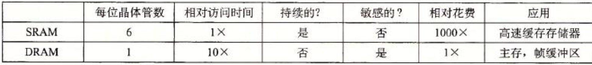
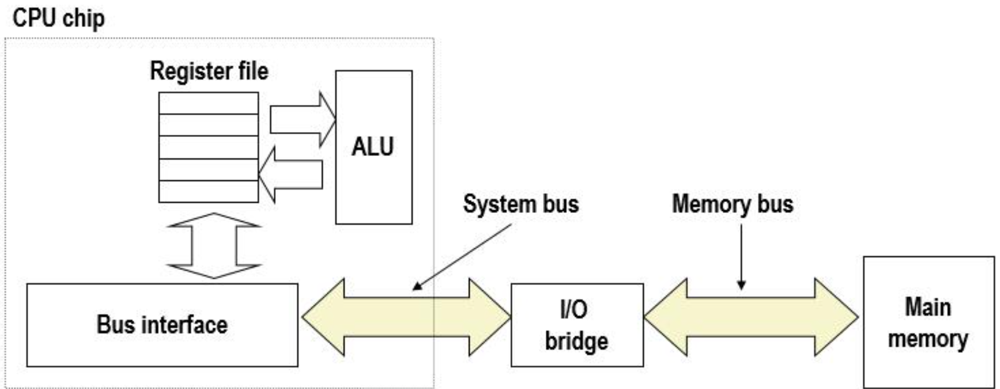
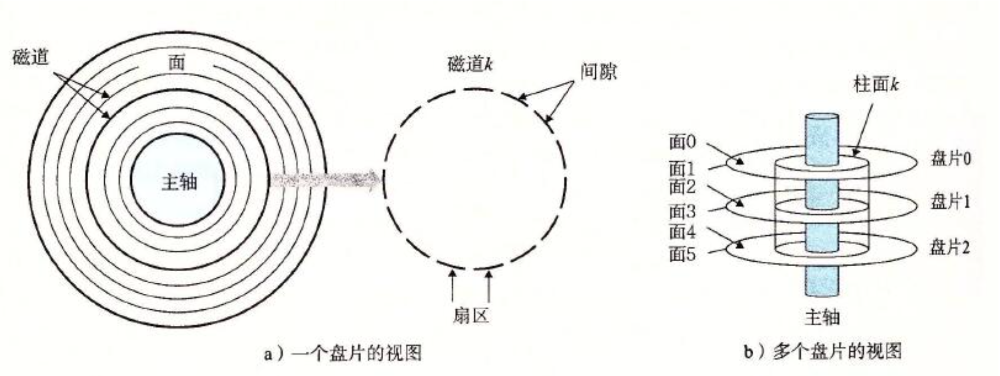
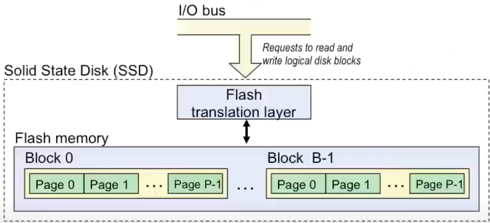
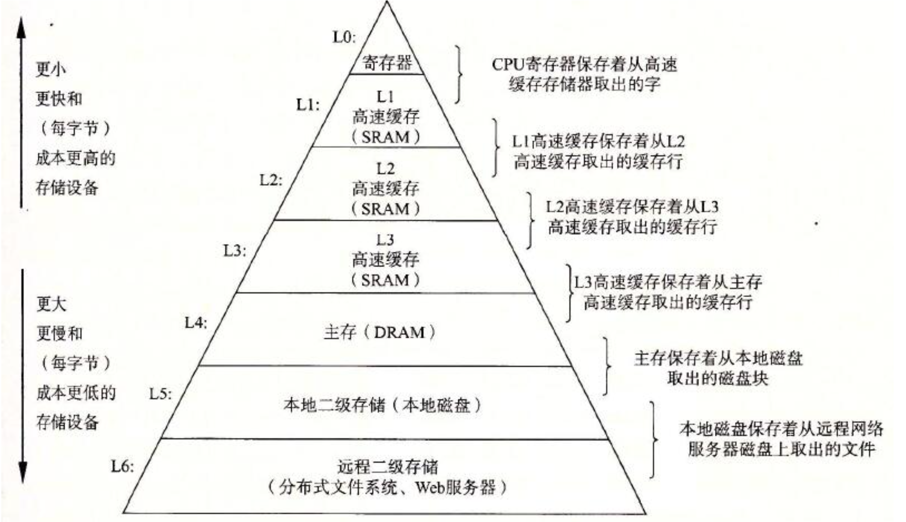

# 存储器层次
* RAM （随机访问内存）
    *  关键特征
        * 传统上将RAM封装为芯片
        * 基础存储单元通常是一个cell
        * 多个RAM芯片形成一个存储器。

    * RAM有两个类型
        * SRAM 静态内存
        * DRAM 动态内存

        * 两种内存比较
            * 

    * 非易失性内存
        * DRAM与SRAM是易失性存储器
            * 如果关闭电源，则会丢失信息
        * 非易失性内存即使关闭电源也能保留数据
            * ROM（Read-only Memory）：在生产过程中被编程
            * PROM（可编程ROM）：可以编程一次
            * 可擦除的PROM（EPROM）：可以批量擦除（UV，X射线）
            * 电可擦除PROM（EEPROM）：具有电子可擦除功能
            * 闪存：EEPROM。 具有部分（块级）擦除功能
                * 擦除约100,000次后会磨损

        * 非易失性内存的用途
            * 存储在ROM中的固件程序（BIOS，磁盘控制器，网卡，图形加速器，安全子系统等）
            * 固态硬盘（替换拇指驱动器，智能电话，mp3播放器，平板电脑，笔记本电脑等中的旋转磁盘）
            * 磁盘缓存

* 传统总线架构连接CPU与内存
    * 总线是承载地址，数据和控制信号的并行导线的集合。
    * 总线可以被多个设备共享
    * 

    * 内存读取与传输
        * CPU在内存总线指定A的地址，并从内存中读取地址A的值X。
        * CPU通过总线得到内存传输过来的值X后并读取/

    * 内存写入与传出
        * CPU讲地址A通过总线传输到内存中，内存得到地址后，并等待数据的到达。
        * CPU讲数据X放入总线中并传输
        * 内存从总线得到数据X之后写入到地址A中

    
* 旋转磁盘
    * 

    * 磁盘有盘片组成，每个盘片有两个表面
    * 每个表面由称为磁道的同心环组成
    * 每个磁道由被间隙隔开的扇区组成

    * 磁盘容量
        * 

    * 磁盘访问时间
        *  访问某些目标扇区的平均时间，近似为
            * $ Taccesss = Tavg Seek + Tavg rotation + Tavg + transfer $

        * 寻道时间 （Tavg Seek ）
            * 磁头定位到达目标扇区的时间
            * 通常在3-9ms之间

        * 旋转延迟 （Tavg rotation）
            * 等待目标扇区的第一位通过读/写头的时间。
            * $ Tavg rotation = 1/2 * 1 / RMPs * 60/1min $
            * 平均旋转为7200RPM
        
        * 传输时间（Tavg transfer）
            * 从目标扇区读取比特的时间
            * $ Tavg transfer = 1/RPM + 1(avg #sector / track) * 60sec/1min $

    * 逻辑磁盘块
        * 现代磁盘为复杂的扇区几何提供了一个更简单的抽象视图
            * 可用扇区集建模为一系列比大小的逻辑块（0，1，2，。。。）
        * 逻辑块鱼实际（物理）扇区之间的映射
            * 由磁盘控制器的硬件/固件设备维护
            * 将对逻辑块的请求转换为（表面，轨道，扇区）三元组
        * 允许控制器为每个区域预留备用柱面

* 固态硬盘（SSD）
    * 
    * 每个页的大小为512k到4k之间，每个块包含32个页到128叶
    * 数据的读与写以页为单位
    * 对页的写操作只有在块被清除之后才可以。
    * 一个块的寿命大致为100，000次擦写。

    * SSD的妥协与旋转磁盘
        * 优势
            * 没有机械装置的移动，更加的快速
        * 劣势
            * 有可能磨损
            * 2015年每字节大概贵30倍

        * 应用 
            * mp3 智能手机

* 对比
    * [CPU与内存的对比](images/CPU与内存的对比.png)

* 局部性
    * 局部性的原则：程序倾向于使用过去曾经使用过或者离使用过相近的指令或数据

    * 时间局部性
        * 近期被访问过的项目很有可能在不久额的将来再一次被访问
    * 空间局部性            
        * 地址接近的项往往会在比较接近的时间内被引用

    * 例子
        * 
        ```
            sum = 0;
            for (i = 0; i < n; i++)
                sum += a[i];
            return sum;
        ```
        * 步长为1 每一次都访问较近范围的数据因此具有好的局部性

* 内存结构
    * 硬件和软件的一些基本和持久属性
        * 快速存储技术每字节成本更高，容量更小且需要更多功率（热量！）。
        * CPU和主内存速度之间的差距越来越大。
        * 编写良好的程序倾向于展现良好的局部性。

    * 这些基本特性完美的互补
    * 内存和存储系统的层次结构
        * 

* 缓存
    * 一个更小，更快的存储设备，可充当较大较慢数据集的暂存区域。
    * 内存层级结构的基本思想
        * 对于每一个k更快，更小的设备在k级别作为缓存服务于更大，更慢的k+1级别的设备。
    * 为什么内存层级结构有效？
        * 因为存在局部性，程序比起访问k+1级别的数据更倾向于访问在  k 层级的数据。
        * 因此k+1级别的存储器可以更加慢且大并且便宜。

    * 重要构想：内存层次结构创建了一个大型存储池，其成本与底部附近的廉价存储相同，但以顶部附近的快速存储的速率向程序提供数据

    * 缓存命中与缓存不命中
        * 当缓存不命中时，执行替换策略。有随机替换与LRU（最近最少被使用）替换策略

    * 常规缓存概念： 
        * 冷未命中
            * 由于缓存为空而发生
        * 冲突未命中
            * 大多数高数缓存将级别k+1de块限制为级别K的块位置的一小部分子集
                * 例如。 $K+1$级的块i必须放置在第$K$级的块 $ i mod 4 $中。

            * 当级别 $K$高速缓存足够大，但是数据对象都映射到同一级别k块时，就会发生冲突未命中。
                * 例如 每次引用块 0， 8，0， 8，0， 8，0， 8。。。。 

        * 容量为命中
            * 当活动高速缓存块的集合大于高速缓存时发生

            
