# 缓存
* 高速缓存存储器的组织和操作
    * 高速缓存存储器是小型，基于SRAM的快速存储器，可在硬件中自动管理
        * 保留经常访问的主内存块
    * CPU首先在缓存中查询数据

    * 典型系统结构
        * 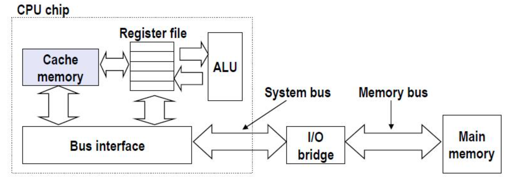


* 高速缓存（S，E，B）的通用组织
    * 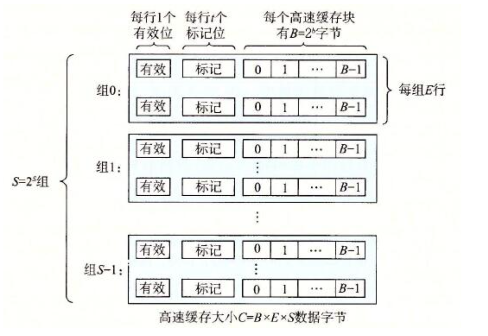

    * 高速缓存读取
        * 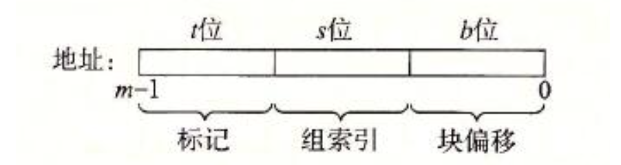

        * 利用上图的结构进行高速缓存读取，索引组判断属于哪个组，块偏移确定了B个字节的数据块中的字偏移，标记位确定标记。

        * 例子
            * 考虑 E= 2的情况
                * 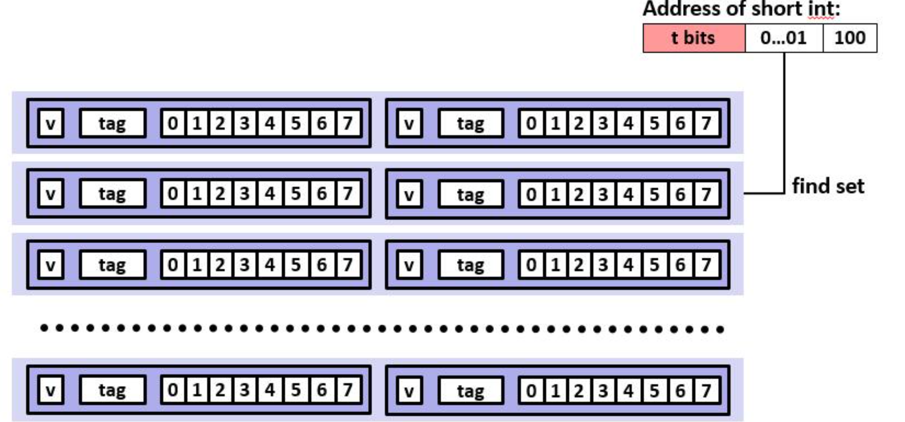

            * 首先通过0....001（组索引位） source位的值，确定组（S）的位置
            * 其次通过标记位的值（t bits) 确定每个组中行的位置，
                * 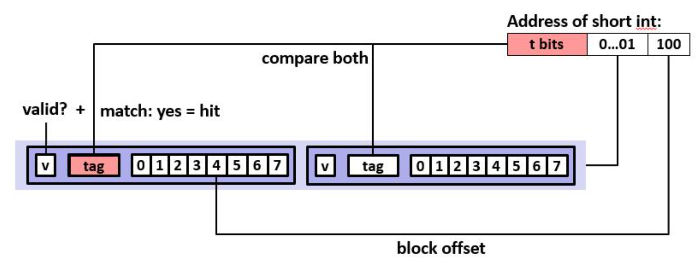 
            * 最后根据块偏移位(B) 去定读取缓存中读取块的位置
                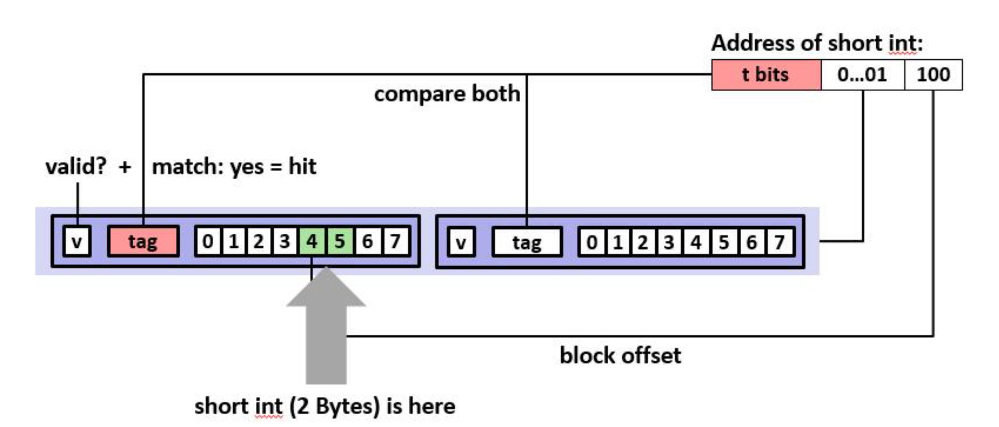

            * 如果行的有效位被标记则表明缓存命中，如果未命中则从下一级的存储器中取值。

            
        * 具体例子
            * 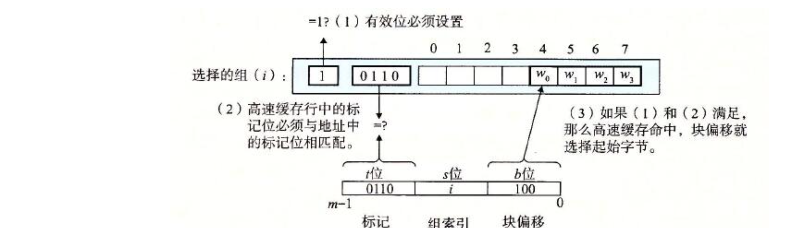

            

    * 写
        * 存在多个数据副本
            * L1, L2, L3, 内存， 磁盘

        * 写命中如何处理
            * 直写 （write-through） 直接写入内存
                * 不推荐使用，因为会产生很多总线流量
            * 写回（write-back） 尽可能推迟写入内存，直到数据在缓存中要被擦除之前写入内存
                * 需要一个dirty-bit，用来确定该缓存值是够被修改过

        * 发生写不命中怎么办
            * write-miss（加载到缓存中，更新行在缓存中）
                * 如果有跟个多写入该位置的信息，则很好
            * No-write-allocate （直接写入内存，不加载到缓存中）
        * 典型的策略
            * Write-through + No-write-allocate
            * Write-back + Write-allocate

* 高速缓存性能指标
    * 不明中率
        * 当缓存中找不到的内存引用比例（丢失/访问） = $ 1 - hit rate $
        * 典型数字
            * L1位3-10%
            * 对于L2来说可能很小，具体取决于大小等
    * 命中时间
        * 从高速缓存窜送一个字到CPU所需时间
            * 包括确定行是否在缓存中的时间
        * 典型数字
            * L1需要4个时钟周期
            * L2需要10个时钟周期
    * 不命中处罚
        * 因为错过而需要额外的时间
        * 内存通常需要50-200个周期

    * 例子
        * 比较99%命中率和97%命中率的平均读取时间
            * 97%  $ 1 + 0.03 * 100 = 4$
            * 99%  $ 1 + 0.01 * 100 = 2$

* 编写高速缓存友好的代码
    * 使最常见的清醒快速运行
        * 专注于核心功能的内循环
    * 最小化内部循环中的不明中率
        * 重复引用变量是好的（时间局部性）
        * 步长为1的引用模式很好 （空间局部性）

* 缓存的性能影响
    * 读吞吐量
        * 每秒从内存读取的字节数

    * 存储器山
        * 测试读吞吐量与空间和时间局部性关系
            * 表示存储器系统性能的紧凑方法
        * 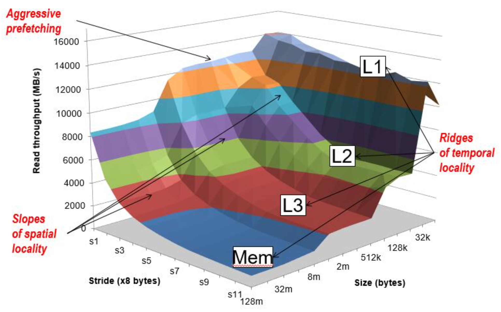

        * 测试代码
            * 
            ```
                long data[MAXELEMS];  /* Global array to traverse */

                /* test - Iterate over first "elems" elements of
                *        array “data” with stride of "stride", using 
                *        using 4x4 loop unrolling.                                                            
                */ 
                int test(int elems, int stride) {
                    long i, sx2=stride*2, sx3=stride*3, sx4=stride*4;
                    long acc0 = 0, acc1 = 0, acc2 = 0, acc3 = 0;
                    long length = elems, limit = length - sx4;

                    /* Combine 4 elements at a time */
                    for (i = 0; i < limit; i += sx4) {
                        acc0 = acc0 + data[i];
                        acc1 = acc1 + data[i+stride];
                        acc2 = acc2 + data[i+sx2];
                        acc3 = acc3 + data[i+sx3];
                    }

                    /* Finish any remaining elements */
                    for (; i < length; i++) {
                        acc0 = acc0 + data[i];
                    }
                    return ((acc0 + acc1) + (acc2 + acc3));
                }
            ```

* 重新排列以改善空间局部性
    * 矩阵乘法
        * 
        ```
            /* ijk */
            for (i=0; i<n; i++)  {
            for (j=0; j<n; j++) {
                sum = 0.0;
                for (k=0; k<n; k++) 
                sum += a[i][k] * b[k][j];
                c[i][j] = sum;
            }
            } 
        ```    

        * 这个方法的效率较低，从内存布局可以看出
            * 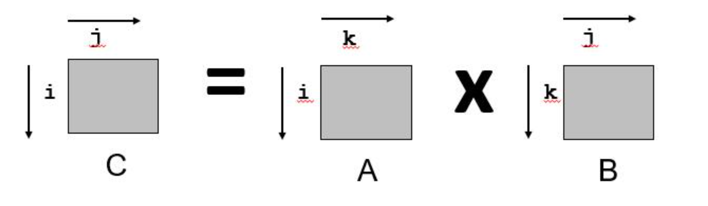

            * 下面的方法效率较高，因为每次循环的步长为1。
            ```
                /* kij */
                for (k=0; k<n; k++) {
                    for (i=0; i<n; i++) {
                        r = a[i][k];
                        for (j=0; j<n; j++)
                        c[i][j] += r * b[k][j];   
                    }
                }
            ```

            * 示意图
                * 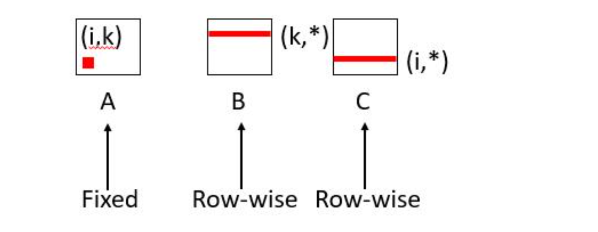

* 使用分块以改善局部性
    * 高速缓存未命中的分析

    * 假设
        * 矩阵元素是双精度
        * 高速缓存块 = 8 doubles
        * 缓存大小C << n (比n小很多)

    * 第一次迭代    
        * $n/8 + n = 9n/8 $ 次未命中

    * 分块矩阵乘法
        * 
        ```
            c = (double *) calloc(sizeof(double), n*n);

            /* Multiply n x n matrices a and b  */
            void mmm(double *a, double *b, double *c, int n) {
                int i, j, k;
                for (i = 0; i < n; i+=B)
                    for (j = 0; j < n; j+=B)
                        for (k = 0; k < n; k+=B)
                    /* B x B mini matrix multiplications */
                            for (i1 = i; i1 < i+B; i++)
                                for (j1 = j; j1 < j+B; j++)
                                    for (k1 = k; k1 < k+B; k++)
                                        c[i1*n+j1] += a[i1*n + k1]*b[k1*n + j1];
            }
        ```
        * 图示
            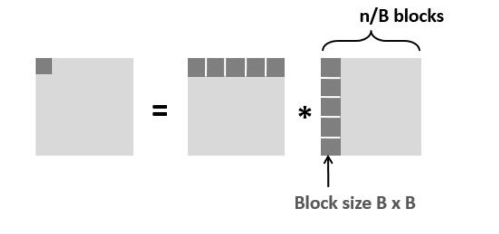

        * 未命中分析
            * 假设
                * 高速缓存块 = 8 doubles
                * 缓存大小 $ C << n $
                * 三个分块可以放入缓存 $ 3B^2 < C $


            * 第一次迭代
                * 每个方块 $ B * B / 8 = B^2/8 $
                * 总共 $ 2n/B * B^2/8 = nB/4  $ (忽略矩阵C)
            
            * 总共未命中
                * $ nB/4 * (n/B)^2  = n^3/(4B)$ 

        * 分块总结
            * 无分块 $  (9/8) * n^3 $
            * 分块 $ 1/(4B) * n^3 $
            * 建议选择最大的B， 使得 $ 3B^2 < C $

            * 产生巨大差异的原因
                * 矩阵乘法具有固有的时间局部性
                    * 输入数据 $ 3n^2 $ 计算 $ 2n^3 $
                    * 每个数组元素使用 $ 0(n) $次 