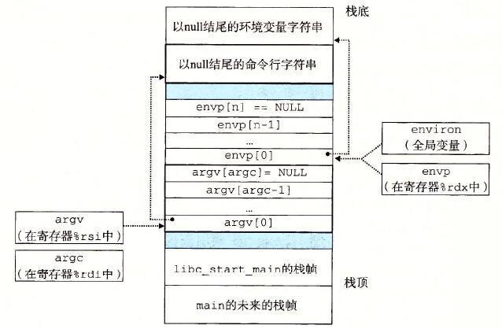

# 异常控制流
* 控制流
    * 处理器只做一件事情
        * 从开机到关机，CPU读取与执行一系列的的指令。每次只读取一个
        * 该序列就是CPU的控制流
        * 也被称为物理控制流
        * 

* 改变控制流
    * 到目前为止：有两种机制来改变控制流
        * 跳转与分支
        * 调用与返回
        * 对程序状态的变化做出反应

    * 对于有用的系统而言不够：难以对系统状态的变化做出反应
        * 数据从磁盘或网络到达
        * 除零的指令
        * 用户在键盘上敲击Ctrl-C
        * 系统计时器到期

* 异常控制流
    * 在所有计算机系统中存在
    * 低级别机制
        * 异常
            * 作为系统时间的响应的控制流的变化（即系统状态的改变）
            * 硬件与操作系统的组合的实现
    * 高级别机制
        * 处理器的上下文切换
            * 由操作系统与硬件共通实现
        * 信号
            * 由操作系统实现
        * 非本地跳转表
            * 由C运行库实现
* 异常
    * 一个异常是响应某些事件（即处理器状态更改）将控制权转移到OS内核。
        * 内核时驻留在内存的操作系统的一部分
        * 事件例子：除0，算术溢出，页错误
    * 

    * 异常表
        * 每一个异常事件都有一个唯一的数字K与之对应
        * K 作为异常表的索引
        * 每当异常发生时根据K的值索引到异常处理程序
        * 

    * 异常的类别
        * 非同步异常（中断）
            * 由处理器的外部引起
                * 通过设置处理器的中断引脚来指示
                * 异常处理程序返回到下一个指令

            * 例子
                * 计时器中断
                    * 每隔几ms（毫秒）外部计时芯片触发一次中断
                    * 被用于从用户城区取回控制权到内核程序
                * 来自外部设备的I/O中断
                    * 敲击Ctrl-c
                    * 来自网络的包到达
                    * 来自磁盘的数据到达

        * 同步异常
            * 由执行指令引起
                * 陷阱
                    * 有意的异常
                    * 例子： **系统调用** ， 断电， 特别的指令
                        * 系统调用
                            * 每个x86-64系统调用都具有一唯一的识别号码
                            * 例子
                                * 
                    * 返回到下一个指令
                * 故障
                    * 无意但可以被恢复
                    * 例子：页故障（可恢复），保护故障（不可恢复），浮点数异常
                    * 回重新执行一遍当前指令或终止

                * 终止
                    * 无意且不可恢复
                    * 例子：非法指令，奇偶校验错误，机器检查
                    * 终止当前程序
                
* 进程
    * 定义：一个正在运行中的程序的实体
    
    * 处理器提供每一个程序两个关键的抽象
        * 本地控制流
            * 每个程序似乎都专用于CPU。
            * 由称为上下文切换的内核机制提供。

        * 私有地址空间
            * 每个程序似乎都专用于主存储器。
            * 由虚拟内存的内核机制提供

    * 进程并发
        * 每个进程是一个逻辑控制流
        * 如果两个进程的时间重叠，则两个进程将同时运行（并发）。
        * 否则它们是序列的执行  
        * 例子
            * 并发 $A-B, A-C$
            * 顺序 $B-C$

            * 

        * 用户视角下的并发
            * 并发进程的控制流在时间上实际上是不相交的
            * 但是，我们可以将并发进程视为彼此并行运行
            
            * 

    * 上下文切换
        * 进程被称作内核的驻存在内存中的操作程序代码管理
        * 内核不是一个独立的进程，而是作为某些现有进程的一部分运行的。
        * 控制流从一个进程到另一个进程叫做上下文切换
        * 

    * 系统调用错误处理
        * 出错时，Linux系统级函数通常返回-1，且设置全局变量$errno$用于指示出错的原因
        * 惯例
            * 必须检查所有系统级函数的返回状态
            * 处理返回值时void  
            * 
            ```
            if ((pid = fork()) < 0) {
                fprintf(stderr, "fork error: %s\n", strerror(errno));
                exit(0);
            }
            ```

    * 错误处理包装函数
        * 我们使用Stevens风格的错误处理包装器进一步简化了我们提供的代码：
        * 
        ```
            pid_t Fork(void)
            {
                pid_t pid;

                if ((pid = fork()) < 0)
                    unix_error("Fork error");
                return pid;
            }
        ```

    * 获取进程id
        * 获取当前进程ID
        ```
            pid_t getpid(void)
        ```
        * 获取父进程ID
        ```
            pid_t getppid(void)
        ```

    * 创建和终结进程
        * 从程序员的视角，可以认为进程有三种的状态
        * 运行
            * 进程正在执行中或正在等待执行，并且最终将由内核调度（即选择执行）
        * 停止
            * 进程执行被暂停，并且只有在另行通知之前才会调度
        * 终止
            * 进程永久停止

    * 终止进程
        * 进程有一下三种原因停止
            * 接受一个信号的默认执行行为是终止
            * 从main函数返回
            * 调用exit函数
        
        * void exit(int status)
            * 以status退出状态来终止进程
            * 约定：正常返回状态为0，出错时为非零
            * 显式设置退出状态的另一种方法是从主进程返回整数值

        * exit只会被调用一次，但永远不会返回。
    
    * 创建进程
        * 调用fork函数由父进程创建新的子进程
        * int fork(void)
            * 返回0给子进程，返回子进程pid给父进程。
            * 子进程几乎与父进程相同
                * 子进程获得父进程虚拟地址空间的相同（但独立）副本。
                * 子进程获得父进程打开文件描述符的相同副本。
                * 子进程的pid与父进程不同
        * fork函数调用一次返回两次。
            * 调用一次，返回两次
            * 并行执行
                * 无法预测父进程与子进程的执行顺序
            * 相同但独立的地址空间
                * 当fork在父进程和子进程中返回时，x的值为1
                * x的后续更改是独立的
            * 共享的打开文件
                * 父进程和子进程双方的标准输出相同

        * fork 例子
            * 
            ```
            int main()
            {
                pid_t pid;
                int x = 1;

                pid = Fork(); 
                if (pid == 0) {  /* Child */
                    printf("child : x=%d\n", ++x); 
                    exit(0);
                }

                /* Parent */
                printf("parent: x=%d\n", --x); 
                exit(0);
            }
            ```
            * 
            ```
                linux> ./fork
                parent: x=0
                child : x=2
            ```

    * 使用过程图建模fork
        * 流程图是捕获并发程序中语句的半序的有用工具：
            * 每个顶点都是一条语句的执行
            * a->b表示a在b之前发生
            * 边可以用变量的当前值标记
            * printf顶点可以用输出标记
            * 每个图都以没有入边的顶点开始
        * 图的任何拓扑排序都对应于可行的全序排列。
            * 所有边从左到右指向的顶点的全序排列。

        * 例子
            * 
            ``` 
                int main()
                {
                    pid_t pid;
                    int x = 1;

                    pid = Fork(); 
                    if (pid == 0) {  /* Child */
                        printf("child : x=%d\n", ++x); 
                        exit(0);
                    }

                    /* Parent */
                    printf("parent: x=%d\n", --x); 
                    exit(0);
                }
            ```
            * 原始图 
                * 
            * 排序后的图
                * 

    * 回收子进程
        * 理念
            * 当进程终止，它仍然消耗着系统资源
                * 例子： 停止状态，各种系统表
            * 这种进程被称为**僵死进程**
                * 半死不活的状态

        * 回收
            * 由父进程对终止的子进程执行（使用wait或waitpid）
            * 父进程被给予退出状态信息
            * 内核删除僵死进程
        * 如果父进程未进行回收
            * 如果父进程已经终止，却未回收子进程，那么内核进程（pid=1）将称为孤儿进程的父进程
            * 因此，长期运行的进程中会进行显式回收，否则会消耗系统的内存资源。
                * 例如：shell和服务器
        * 示例1
            * 
            ```
            void fork7() {
                if (fork() == 0) {
                    /* Child */
                    printf("Terminating Child, PID = %d\n", getpid());
                    exit(0);
                } else {
                    printf("Running Parent, PID = %d\n", getpid());
                    while (1)
                        ; /* Infinite loop */
                }
            }
            ```

            * 运行结果
            ```
                linux> ./forks 7 &
                [1] 6639
                Running Parent, PID = 6639
                Terminating Child, PID = 6640
                linux> ps
                PID TTY          TIME CMD
                6585 ttyp9    00:00:00 tcsh
                6639 ttyp9    00:00:03 forks
                6640 ttyp9    00:00:00 forks <defunct>
                6641 ttyp9    00:00:00 ps
                linux> kill 6639
                [1]    Terminated
                linux> ps
                PID TTY          TIME CMD
                6585 ttyp9    00:00:00 tcsh
                6642 ttyp9    00:00:00 ps
            ```
            * ps将子进程显示为“已终止”（即僵死进程）
            * 杀死父进程可以让子进程被init回收

        * 示例2
            * 
            ```
            void fork8()
            {
                if (fork() == 0) {
                    /* Child */
                    printf("Running Child, PID = %d\n",
                        getpid());
                    while (1)
                        ; /* Infinite loop */
                } else {
                    printf("Terminating Parent, PID = %d\n",
                        getpid());
                    exit(0);
                }
            }
            ```

            * 运行结果
                * 
                ```
                linux> ./forks 8
                Terminating Parent, PID = 6675
                Running Child, PID = 6676
                linux> ps
                PID TTY          TIME CMD
                6585 ttyp9    00:00:00 tcsh
                6676 ttyp9    00:00:06 forks
                6677 ttyp9    00:00:00 ps
                linux> kill 6676
                linux> ps
                PID TTY          TIME CMD
                6585 ttyp9    00:00:00 tcsh
                6678 ttyp9    00:00:00 ps                          
                ```

            * 即使父进程已终止，子进程仍处于活动状态
            * 必须明确杀死子进程，否则将无限期运行

        
        * wait 与子进程同步
            * 父进程回收子进程通过调用**wait**函数

            * int wait(int * child_status)
                * 暂停当前进程，直到一个子进程终止
                * 返回值是终止的子进程的pid
                * 如果child_status != NULL，则它将指向的整数将设置为一个值，该值指示子进程终止的原因和退出状态：
                    * 检查通过使用定义在“wait.h”宏，来获取子进程的状态
                        * WIFEXITED，WEXITSTATUS，WIFSIGNALED，WTERMSIG，WIFSTOPPED，WSTOPSIG，WIFCONTINUED

            * 示例
                * 
                ```
                void fork9() {
                    int child_status;

                    if (fork() == 0) {
                        printf("HC: hello from child\n");
                        exit(0);
                    } else {
                        printf("HP: hello from parent\n");
                        wait(&child_status);
                        printf("CT: child has terminated\n");
                    }
                    printf("Bye\n");
                }
                ```

                * 进程图
                    * 
        
        * waitpid 等待特定进程
            * pid_t waitpid(pid_t pid, int & status, int options)
                * 挂起当前进程，直到特定进程终止（pid = -1 时会等待任意子进程）
                * 对于参数，P516页有详细的说明

    * execve：加载和执行程序
        * int execve(char * filename, char * argv, char* envp[])
        * 当前进程中加载和运行
            * 可执行文件 ： filename
                * 可以是对象文件或者是脚本文件（开始与#！/bin/bash)
            * 参数列表 argv
                * argv[0]= filename是惯例
            * 环境变量列表 envp
                * “name=value”的字符传
                * 可使用getenv，putenv，printenv

        * 重写代码，数据，和栈
            * 保留PID，打开的文件以及信号上下文
        * 调用一次，用不返回
            * 除非有错误

    * 新程序开始时的栈结构
        * 

    * execve例子
        * 在子进程执行/bin/ls -lt /usr/include
        * 当前使用环境
            * 

        