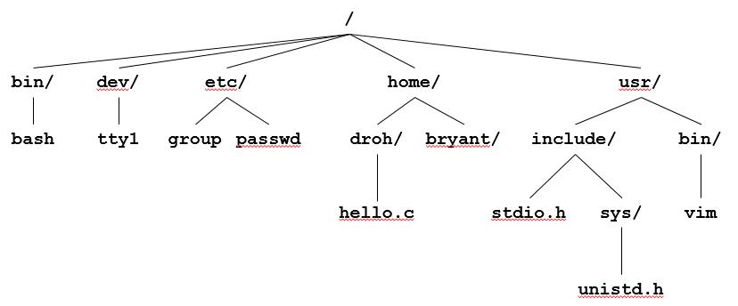

# 第16节 系统级I/O
* Unix I/O概述
    * 一个Linux文件是m个字节序列
        * B0，B1, B2,B3,...Bm-1
    * 所有I/O设备被表示为文件
        * /dev/sda2 (/usr 磁盘分区)
        * /dev/tty2（终端）
    * 即使内核也被表示为一个文件
        * /boot/vmlinuz-3.13.0-55-generic (kernel image)
        * /proc                           (kernel data struct)
    
    * 将设备优雅地映射为文件的方式，允许Linux内核引出一个简单，低级的应用接口，称为Unix I/O：
        * 打开 关闭文件
            * open() , close()
        * 读取与写入文件
            * read(),  write()
        * 修改当前文件位置（seek）
            * 指示文件中下一个要读取或写入的偏移量
            * lseek()
                
* 文件类型
    * 每一个文件有一个类型用于指示在系统中的角色
        * 普通文件：包含任意数据
        * 文件夹：一组相关文件的索引
        * 套接字： 与其他的机器的进程进行通信
    * 其他文件类型（不在本书考虑范围内）
        * 命名通道（FIFO）
        * 符号链接
        * 字符和块设备

    * 普通文件
        * 一个普通包含任意数据
        * 应用程序通常区分为文本文件与二进制文件
            * 文本文件是仅包含ASCII或Unicode字符的常规文件
            * 二进制文件是所有其他文件
                * 例如目标文件，JPEG图像
            * 内核不知道区别！
        * 文本文件是文本行的序列
            * 文字行是由换行符（’\n’）终止的字符序列
            * 换行符为0xa，与ASCII换行符（LF）相同
        * 其他系统中的行尾（EOL）指示器
            * Linux和Mac OS：“ \n”（0xa）
                * 换行（LF）
            * windows和internet协议 ：“\r\n”（0xd，0xa）
                * 回车（CR） ，然后换行 （LF）
    
    * 目录
        * 目录包含链接的数组
            * 每个链接映射一个文件名到一个文件
        * 每个文件包含至少两个入口
            * .   链接到自己
            * ..  链接到上一级目录
        * 操作目录的指令
            * mkdir
            * ls
            * rmdir

        * 目录层级结构
            * 

            * 目录层次结构中的位置用路径名指定
                * 绝对路径

                * 相对路径

* 打开文件
    * 打开文件会通知内核您已准备好访问该文件
        * 
        ```
            int fd;
            if((fd = open("/etc/hosts", O_RDONY) <0)
                perror( "open failed");
            exit(1);
        ```
    * 返回的一个小的识别整数为**文件描述符**
        * fd = -1 表明出现了异常

    * limit 指令表示系统中的各种限制条件，其中定义了一个进程可以同时打开的个数
        * 在ubuntu中使用ulimit -a
    
    * Linux shell程序创建的每个进程都以与终端相关联的三个打开文件开始运行： 
        * 0 标准输入（STDIN）
        * 1 标准输出（STDOUT）
        * 2 标准错误（STDERR）
    
* 关闭文件
    * 关闭文件通知内核终止了对文件的访问
        * C
        ```
            int fd;     /* file descriptor */
            int retval; /* return value */

            if ((retval = close(fd)) < 0) {
            perror("close");
            exit(1);
            }
        ```

    * 关闭一个已经关闭的文件是线程程序中灾难的根源（稍后会详细介绍）
    * 约定：始终检查返回代码

* 读取文件
    * 读取一个文件从文件的当前位置复制子节到内存，然后更新文件位置
    * c
    ```
    chat buf[512];
    int fd;
    int nbytes;
    if((nbytes = read(fd, buf, sizeof(buf)))< 0)
        perror("read ");
        exit(1)
    ```
    
    * 从文件实际读取到缓冲区的字节大小会被返回
        * 返回值的类型为ssize_t 的类型为有符号整数
        * 如果返回值小于0 表明出现了错误
        * 不足值(nbytes < sizeof(buf) )是可能的，并且不是错误！

* 写文件
    * 写入文件会将字节从内存复制到当前文件位置，然后更新当前文件位置
    * C
    ```
        char buf[512];
        int fd;       /* file descriptor */
        int nbytes;   /* number of bytes read */

        /* Open the file fd ... */
        /* Then write up to 512 bytes from buf to file fd */
        if ((nbytes = write(fd, buf, sizeof(buf)) < 0) {
        perror("write");
        exit(1);
        }
    ```

    * 返回从buf写入文件fd的字节数
        * nbytes<0表示发生错误
        * 与读取一样，不足值是可能的，并且不是错误！

    * 例子
        * C
        ```
            #include "csapp.h"

            int main(void)
            {
                char c;

                while(Read(STDIN_FILENO, &c, 1) != 0)
                    Write(STDOUT_FILENO, &c, 1);
                exit(0);
            }

        ```

* 关于不足值
    * 可以在以下情况下引发不足值
        * 读到了EOF
        * 从终端读取了文本行
        * 从网络的套接字读取与写入

    * 在以下情况下永远不会发生部族值
        * 从磁盘读取（除了EOF）
        * 向磁盘写入
    * 最佳实践是总是允许出现不足值

* RIO (robust I/O) 包
    * RIO是一组包装程序，可在应用程序中提供高效且强大的I/O，例如短计数限制的网络程序
    * RIO提供两种不同的函数
        * 无缓冲的二进制数据输入和输出
            * rio_readn和rio_writen

        * 文本行和二进制数据的缓冲输入
            * rio_readlineb和rio_readnb
            * 缓冲的RIO例程是线程安全的，可以在同一描述符上任意交织
    * 下载地址http://csapp.cs.cmu.edu/3e/code.html
    
    * 无缓冲RIO输入输出
        * 与Unix read,write接口相同
            * C
            ```
            #include "csapp.h"

            ssize_t rio_readn(int fd, void *usrbuf, size_t n);
            ssize_t rio_writen(int fd, void *usrbuf, size_t n);

            Return: num. bytes transferred if OK,  0 on EOF (rio_readn only), -1 on error 
            ```

    * 对于在网络套接字上传输数据特别有用
        * rio_readn尽在遇到EOF时返回不足值
            * 尽在知道要读多少字节时使用它
        * rio_writen 从步返回不足值
        * 可以在同一描述符上任意交错对rio_readn和rio_writen的调用
        * rio_readn的实现
            * C
            ```
            /*
            * rio_readn - Robustly read n bytes (unbuffered)
            */
            ssize_t rio_readn(int fd, void *usrbuf, size_t n) 
            {
                size_t nleft = n;
                ssize_t nread;
                char *bufp = usrbuf;

                while (nleft > 0) {
                if ((nread = read(fd, bufp, nleft)) < 0) {
                    if (errno == EINTR) /* Interrupted by sig handler return */
                        nread = 0;       /* and call read() again */
                    else
                        return -1;       /* errno set by read() */ 
                } 
                else if (nread == 0)
                    break;              /* EOF */
                nleft -= nread;
                bufp += nread;
                }
                return (n - nleft);         /* Return >= 0 */
            }
            ```
    
    * 带缓冲区的RIO输入输出 
        * 从部分缓存在内部存储器缓冲区中的文件中有效读取文本行和二进制数据
        * c
        ```
            #include "csapp.h"

            void rio_readinitb(rio_t *rp, int fd);

            ssize_t rio_readlineb(rio_t *rp, void *usrbuf, size_t maxlen);
            ssize_t rio_readnb(rio_t *rp, void *usrbuf, size_t n);

                                    Return: num. bytes read if OK, 0 on EOF, -1 on error
        ```

        * rio_readlineb从文件fd读取最多为maxlen个字节的文本行，并将该行存储在usrbuf中
            * 对于从网络套接字读取文本行特别有用
        * 停止条件
            * 读取的最大字节数
            * 遇到EOF
            * 遇到换行符（’\n’）

        * rio_readnb从文件fd读取最多n个字节
        * 停止条件
            * 读取的最大字节数
            * 遇到EOF
        * 可以在同一描述符上任意交错对rio_readlineb和rio_readnb的调用
            * 警告：请勿插入对rio_readn的调用

    * 带缓冲I/O：实现
        * 从文件读取
        * 文件具有关联的缓冲区，来保存已从文件读取但用户代码尚未读取的字节
        * 带缓冲读取
            * [!带缓冲读取](images/带缓冲读取.jpeg)

        * 在Unix文件上的层次结构
            * [Rio读取](images/Rio读取.jpeg)
        
        * 结构体包含的信息
        ```
        typedef struct {
            int rio_fd;                /* descriptor for this internal buf */
            int rio_cnt;               /* unread bytes in internal buf */
            char *rio_bufptr;          /* next unread byte in internal buf */
            char rio_buf[RIO_BUFSIZE]; /* internal buffer */
        } rio_t;
        ```

    * Rio 例子
        * 将文本文件的行从标准输入复制到标准输出
        ```
        #include "csapp.h"

        int main(int argc, char **argv) 
        {
            int n;
            rio_t rio;
            char buf[MAXLINE];

            Rio_readinitb(&rio, STDIN_FILENO);
            while((n = Rio_readlineb(&rio, buf, MAXLINE)) != 0) 
                Rio_writen(STDOUT_FILENO, buf, n);
            exit(0);
        }

        void Rio_readinitb(rio_t *rp, int fd)
        {
            rp->rio_fd = fd;
            rp->rio_cnt = 0;
            rp->rio_bufptr = rp->rio_buf;
        }
        ```

* 元数据，共享和重定向
    * 文件元数据
        * 元数据时关于数据的数据，在这种情况下是文件数据
        * 内核维护每个文件元数据
            * 用户使用stat和fstat函数访问

        * 返回的结构
        ```
        /* Metadata returned by the stat and fstat functions */
        struct stat {
            dev_t         st_dev;      /* Device */
            ino_t         st_ino;      /* inode */
            mode_t        st_mode;     /* Protection and file type */
            nlink_t       st_nlink;    /* Number of hard links */
            uid_t         st_uid;      /* User ID of owner */
            gid_t         st_gid;      /* Group ID of owner */
            dev_t         st_rdev;     /* Device type (if inode device) */
            off_t         st_size;     /* Total size, in bytes */
            unsigned long st_blksize;  /* Blocksize for filesystem I/O */
            unsigned long st_blocks;   /* Number of blocks allocated */
            time_t        st_atime;    /* Time of last access */
            time_t        st_mtime;    /* Time of last modification */
            time_t        st_ctime;    /* Time of last change */
        };

        
        ```

        * 例子
        ```
            int main (int argc, char **argv) 
            {
                struct stat stat;
                char *type, *readok;

                Stat(argv[1], &stat);
                if (S_ISREG(stat.st_mode))     /* Determine file type */
                    type = "regular";
                else if (S_ISDIR(stat.st_mode))
                    type = "directory";
                else
                    type = "other";
                if ((stat.st_mode & S_IRUSR)) /* Check read access */
                    readok = "yes";
                else
                    readok = "no";

                printf("type: %s, read: %s\n", type, readok);
                exit(0);
            }
        ```

        * SHELL
        ```
            linux> ./statcheck statcheck.c
            type: regular, read: yes
            linux> chmod 000 statcheck.c
            linux> ./statcheck statcheck.c
            type: regular, read: no
            linux> ./statcheck ..
            type: directory, read: yes
        ```

    * Unix内核如何表示打开的文件
        * 内核用三个相关的数据结构来表示打开的文件
            * 描述符表：每个进程都有它独立的描述符表，它的表项时由进程打开的描述符来索引的。每个打开的描述表项指向文教表中的一个表项。
            * 文件表：打开文件的集合时由一张文件表来表示的，所有的进程共享这张表。每个文件表的表项组成包括当前的文件位置，引用计数（reference count）（即当前指向该表项的描述符表项数），以及一个只想v-node表中对应表项的指针
            * v-node表：同文件表一样，所有的进程共享v-node表。每个表项包含stat结构中的大多数信息，包括st_mode和st_size成员。

        * 例子： 两个描述符引用两个不同的打开文件。描述符1（stdout）指向终端，描述符4指向打开磁盘文件


        


