# 第17节 虚拟内存 概念
* 地址空间
    * 使用物理地址的系统
        * 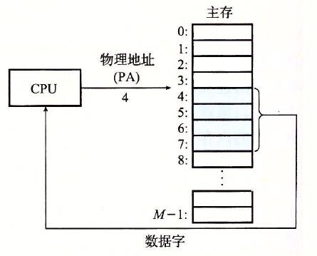
        * 用于“简单”系统，例如汽车，电梯和数码相机等设备中的嵌入式微控制器

    * 使用虚拟地址的系统
        * 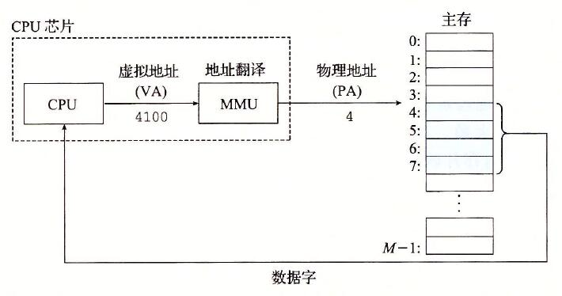
        * 在现代服务器，个人电脑，手机等设备中使用
        * 计算机科学的一个伟大的思想之一

    * 地址空间
        * 线性地址空间：连续的非负整数地址的有序集合
            * $\{ 0,1,2,3... \}$

        * 虚拟地址空间：$N=2^n$ 的虚拟地址的集合
            * $\{0,1,2,3.. , N-1\}$

        * 物理地址空间：$M=2^m$ 的物理地址的集合
            * $\{0,1,2,3.. , M-1\}$

    * 为什么使用虚拟内存
        * 有效的使用主存
            * 将DRAM作为虚拟内存的缓存
        * 简化内存管理
            * 每一个进程取得统一的线性地址空间
        * 地址空间隔离
            * 进程无法插手其他进程的内存
            * 用户程序无法访问内核的代码与数据

* 作为缓存的虚拟内存
    * 概念上，虚拟内存是存储在磁盘上的连续的大小为N的数组
    * 磁盘上数组的内容缓存在物理内存中（DRAM缓存）
        * 缓存块被称为页（page） 大小为（ $P = 2^p$ 字节)
        * 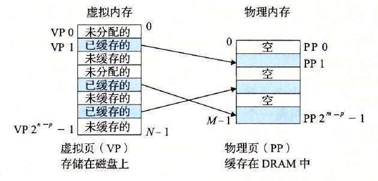

    * DRAM缓存的组织结构
        * DRAM高速缓存组织结构受到巨大的未命中惩罚的驱动
            * DRAM比SRAM大致慢十倍
            * 磁盘比DRAM大致慢一万倍

        * 结果
            * 大的page（块）大小：4KB （典型） 4MB （有些）
            * 全相连的（意思为一组只有一个行）
                * 任意虚拟页可以被放置在任意物理页
                * 需要一个“大的”映射函数-与缓存映射函数不同
            * 高度复杂，昂贵的替换算法
                * 过于复杂且开放式，无法在硬件中实现
            * 写回而不是直写 （可以到缓存的章节查看详细）

    * 启用数据结构：页表
        * 一个页表是一个虚拟页与物理与物理页映射的PTE(页表条目)的数组
            * 每个进程的内核数据结构在DRAM中
            * 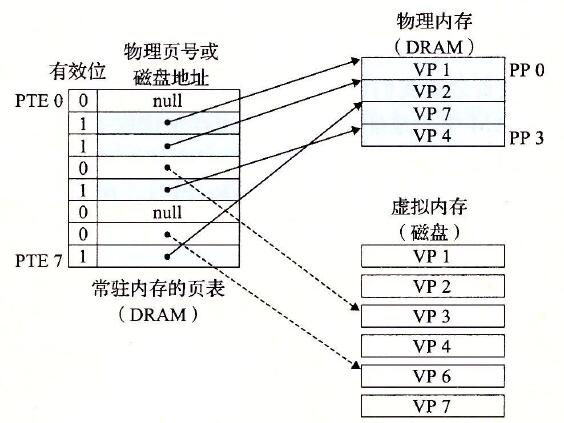

    

    * 页命中
        * 命中：引用的虚拟内存的字数据在物理内存中存在 
        * 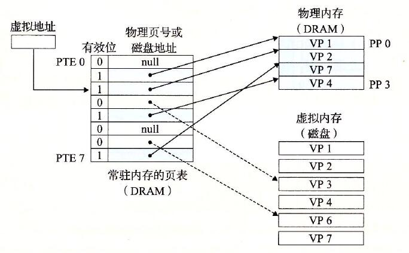

    * 缺页 
        * 引用虚拟内存的字数据不在物理内存中（DRAM 缓存未命中）
        * 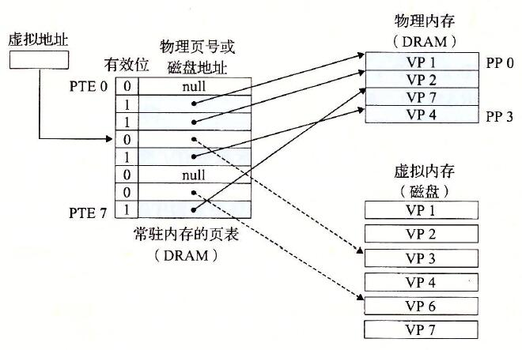

    * 处理缺页
        * 页缺失导致缺页
        * 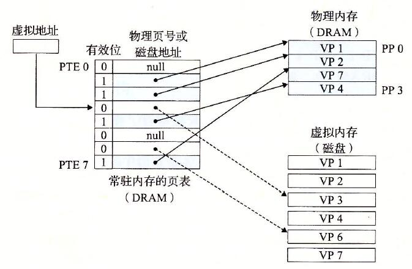
        * 缺页处理程序选择一个牺牲页并对其进行替换（在这里牺牲页是4）
        * 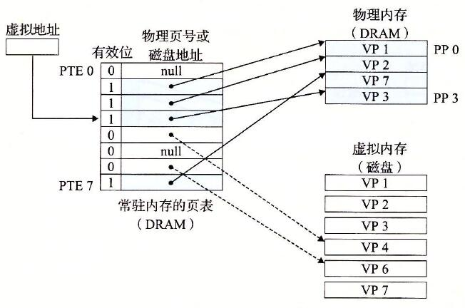
        * 因缺页而停止的指令会被重新执行：页会命中

    * 分配页
        * 分配分配虚拟内存页（VP5）

    * 局部性又一次接了我们
        * 虚拟内存看似非常低效，但因为局部性实际是很有效的。
        * 在任何时间点，程序都倾向于访问称为工作集的一组活动虚拟页面。
            * 时间局部性更好的程序将具有较小的工作集
        * 如果（工作集大小<主存大小）
            * 进程性能良好
        * 如果（SUM(工作集大小)>主存大小）
            * 抖动：性能崩溃，其中页面不断进行交换（复制）

* 虚拟内存作为内存管理工具
    * 关键点：每一个进程有自己的地址空间
        * 可以使内存视为简单的线性数组
        * 映射函数通过物理内存分散地址
            * 精心选择的映射可以改善局部性
        * 简化内存分配
            * 每一个虚拟页可以被任意物理页映射
            * 每一个虚拟页可以在不同时间被不同的物理页存储
        * 在进程间分享代码与数据
            * 映射虚拟页到相同的物理页（如PP6）
            * 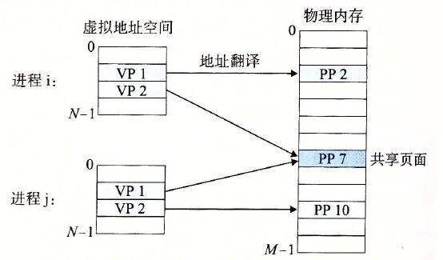

    * 简化链接与加载
        * 链接
            * 每一个进程都有类似的地址空间
            * 代码，数据，堆总是开始与相同的地址
        * 加载 
            * execve 为.text段与.data段分配虚拟页且在页表中将其标记为无效的。
            * 当被虚拟内存系统需要时，将.text 与 .data 节一页一页的复制

* 虚拟内存作为内存保护工具
    * 对页表条目集合进行权限位扩转
    * MMU（内存管理单元）为每一次访问对这些位进行检查
    * 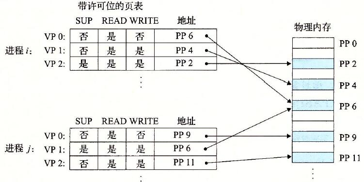

* 地址翻译
    * 虚拟地址空间：$N=2^n$ 的虚拟地址的集合
        * $\{0,1,2,3.. , N-1\}$

    * 物理地址空间：$M=2^m$ 的物理地址的集合
        * $\{0,1,2,3.. , M-1\}$ 
    * 地址翻译
        * 映射：V-》P U {Q}

    * 地址转换符号总结
        * 基本参数
            *   |  符号     | 说明 | 
                | ----------- | ----------- |
                | $N=2^n$     | 虚拟地址空间的内存地址个数 | 
                | $M=2^m$     | 物理地址空间的内存地址个数 | 
                | $P=2^p$     | 页大小（字节）       | 
        * 虚拟地址的组建（VA）
            *   |  符号     | 说明 | 
                | ----------- | ----------- |
                | TLBI     | TLB的索引 | 
                | TLBT     | TLB的标签 | 
                | VPO      | 虚拟页偏移量       | 
                | VPN      | 虚拟页号       | 
        * 物理地址的组建（PA）
            *   |  符号     | 说明 | 
                | ----------- | ----------- |
                | PPO     | 物理页偏移量（与虚拟页偏移量相同） | 
                | PPN     | 物理页大小 | 
                
    * 使用页表进行转换
        * 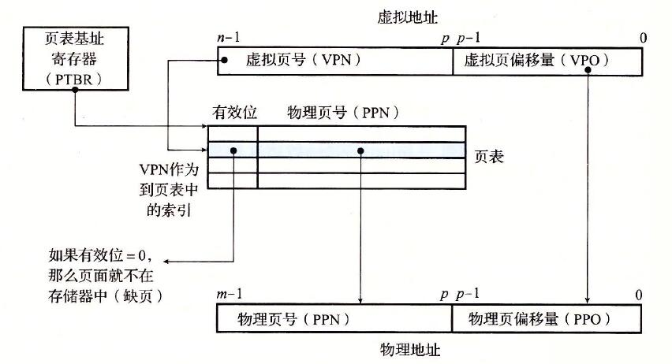

    * 页命中
        * 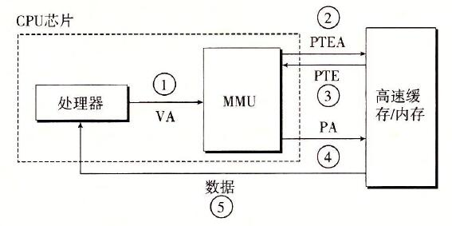

        * 过程
            * 处理器发送一个虚拟你值给MMU（内存管理单元）
            * MMU生成PTE地址，并从高速缓存/主存请求得到它。
            * 高速缓存/主存向MMU返回PTE。
            * MMU构造物理地址，并把它传送给高速缓存/主存。
            * 高速缓存/主存返回所请求的数据字给处理器。

    * 缺页
        * 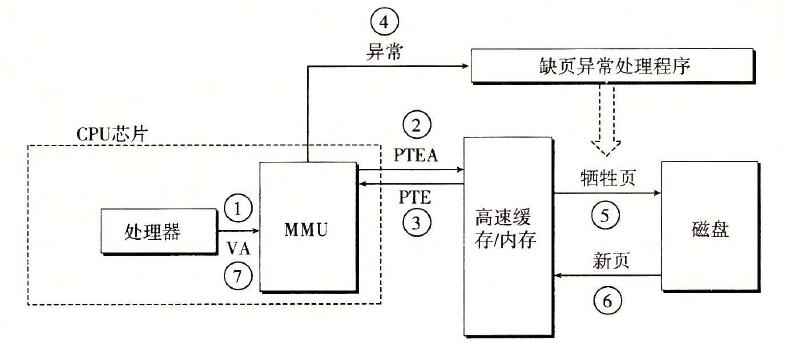
        * 过程
            * 处理器生成一个虚拟地址，并把它传送给 MMU。
            * MMU生成PTE地址，并从高速缓存/主存请求得到它。
            * 高速缓存/主存向MMU返回PTE。
            * PTE中的有效位是零，所以MMU触发了一次异常，传递CPU中的控制到操作系统内核中的缺页异常处理程序。
            * 缺页处理程序确定出物理内存中的牺牲页，如果这个页面已经被修改了，则把它换出到磁盘。
            * 缺页处理程序页面调入新的页面，并更新内存中的PTE。
            * 缺页处理程序返回到原来的进程，再次执行导致缺页的指令。

    * 结合高速缓存和虚拟内存
        * *[地址翻译_结合高速缓存和虚拟内存](images/地址翻译_结合高速缓存和虚拟内存.jpeg)

        
    * 利用TLB加速地址转换
        * 页表条目（PTE）像其他任何存储字一样被缓存在L1中
            * PTE可能会被其他数据
            * PTE命中仍然需要较小的L1延迟
        * 解决方案：翻译后备缓冲区（TLB）
            * MMU中的小型集关联硬件缓存
            * 将虚拟页码映射到物理页码
            * 包含少量页面的完整页面表条目

        * 访问TLB
            * MMU使用虚拟地址的VPN部分访问TLB
            * 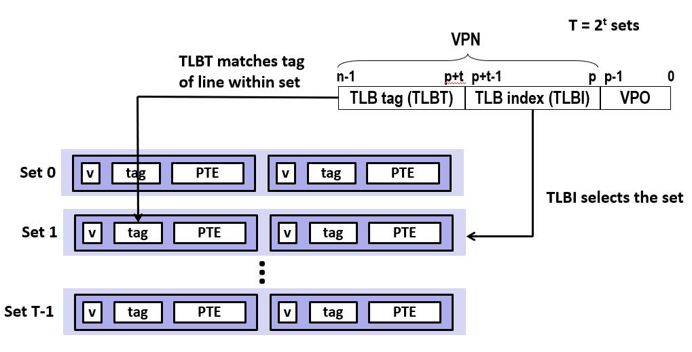

        * TLB命中
            * 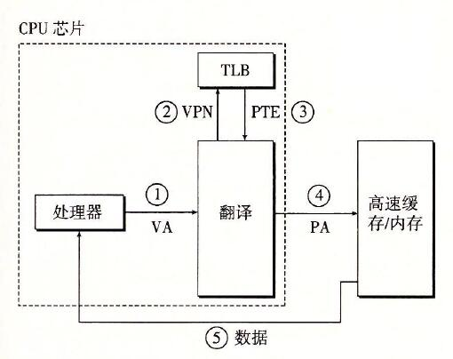
        
        * TLB未命中
            * 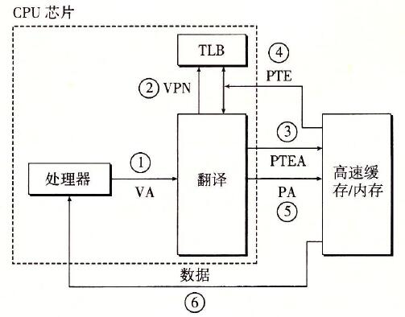

    * 多级页表
        * 假设 页大小为4Kb，48位的地址空间，每个PTE大小为8字节
        * 问题：
            * 需要一个512GB的页表
                * 

        * 解决办法 ： 多级页表
        * 例子： 2级页表
            * 1级表：每个PTE指向页表（在内存中常驻）
            * 2级表：每个PTE指向页（页进与页出方式与其他数据相同）

        * 二级页表的层次结构
            * 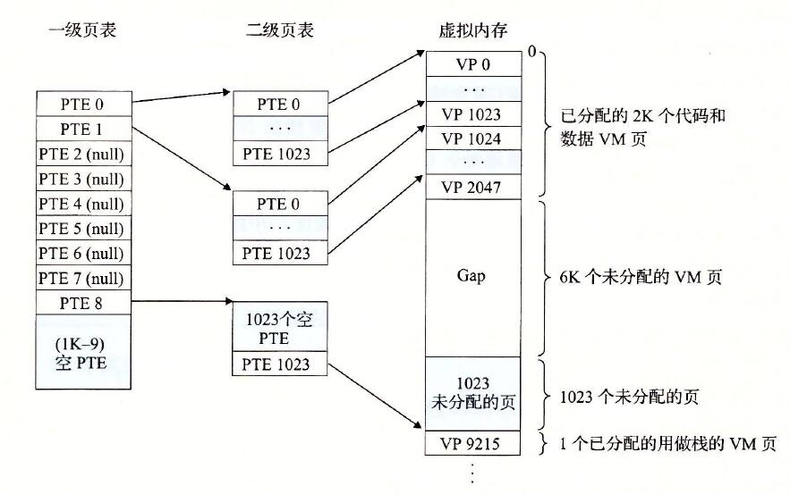

        * 使用K级页表进行地址翻译
            * 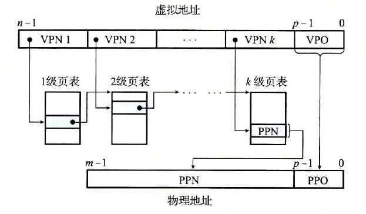

        

