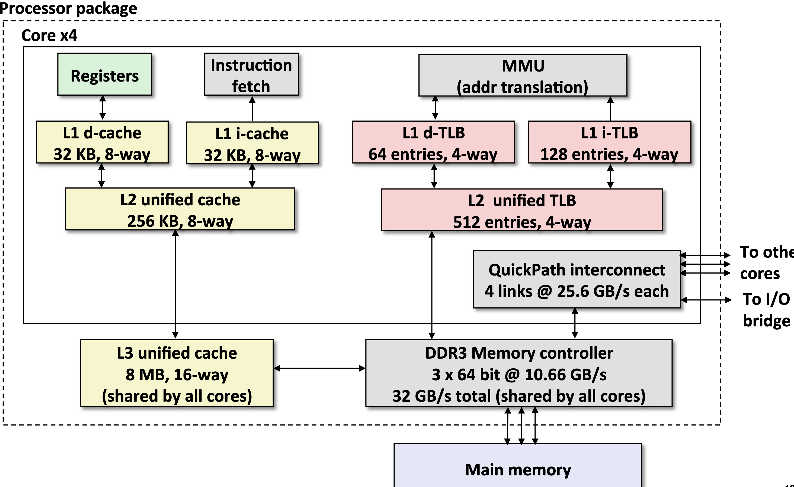
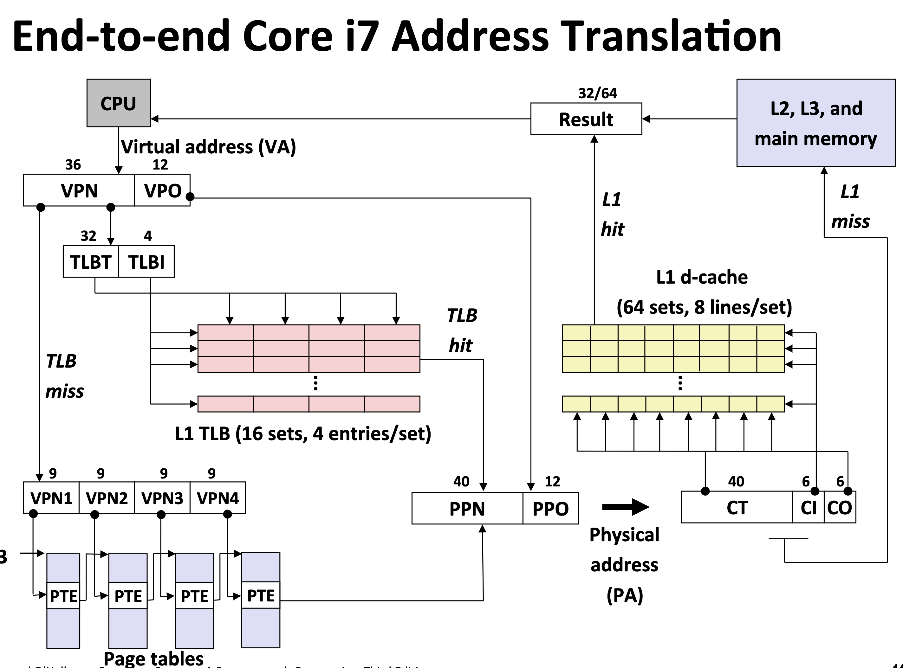
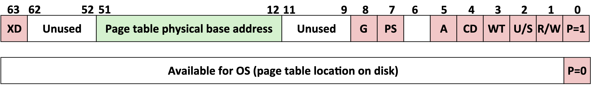
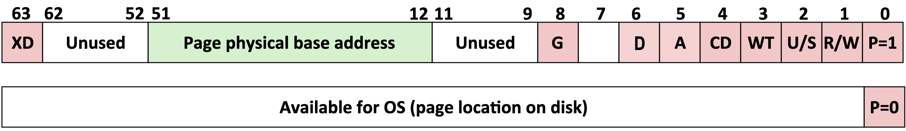
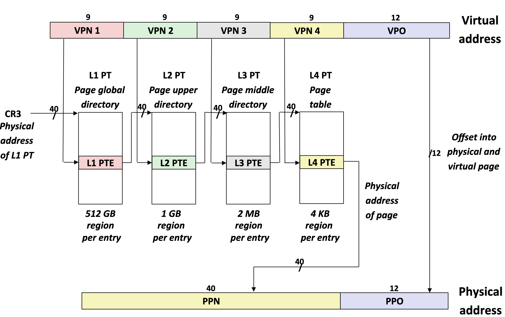
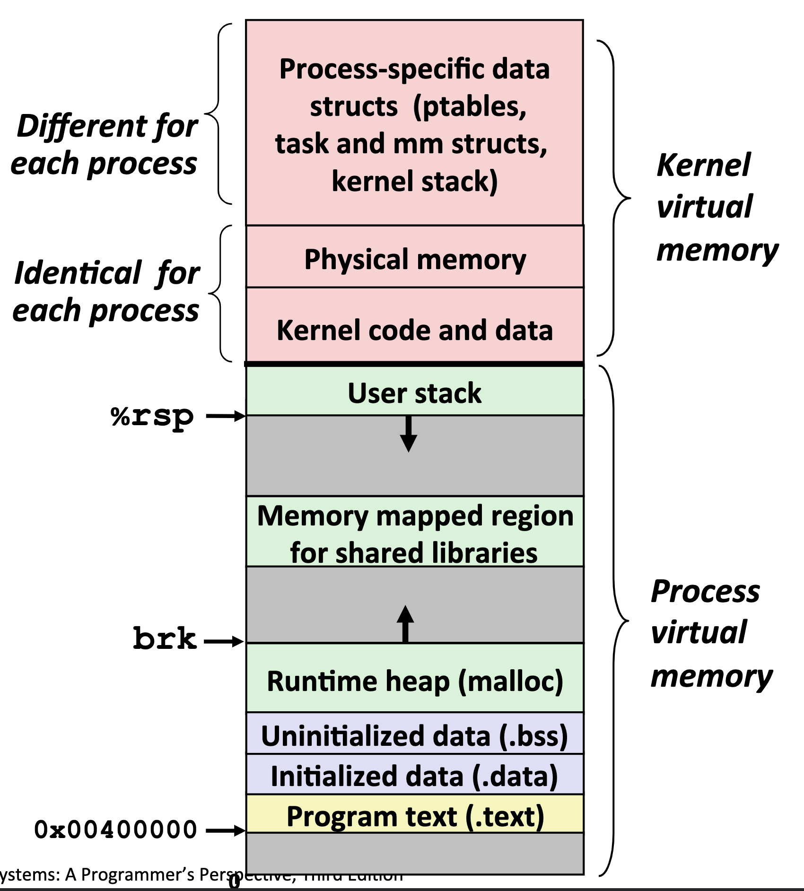
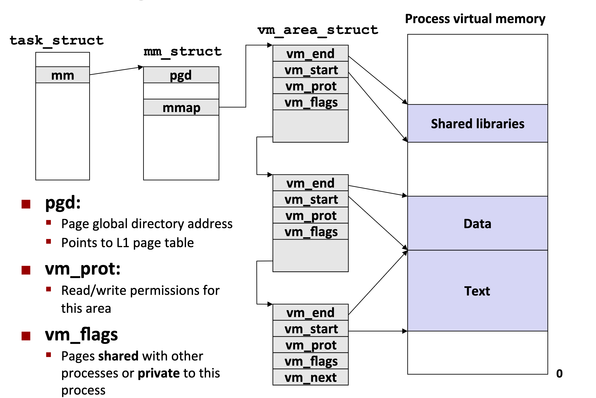

# 第18节 虚拟内存：系统
* 简单内存系统例子
    * 简单内存的详细可参考P573页 
    * 符号
        * 基本参数
            *   |  符号     | 说明 | 
                | ----------- | ----------- |
                | $N=2^n$     | 虚拟地址空间的内存地址个数 | 
                | $M=2^m$     | 物理地址空间的内存地址个数 | 
                | $P=2^p$     | 页大小（字节）       | 
        * 虚拟地址的组建（VA）
            *   |  符号     | 说明 | 
                | ----------- | ----------- |
                | TLBI     | TLB的索引 | 
                | TLBT     | TLB的标签 | 
                | VPO      | 虚拟页偏移量       | 
                | VPN      | 虚拟页号       | 
        * 物理地址的组建（PA）
            *   |  符号     | 说明 | 
                | ----------- | ----------- |
                | PPO     | 物理页偏移量（与虚拟页偏移量相同） | 
                | PPN     | 物理页大小 | 
                | CO      | 缓存偏移量 | 
                | CI      | 缓存索引 | 
                | CT      | 缓存标签 | 

* Intel Core I7 内存系统
    * I7虚拟内存系统
        * 

    * I7端到端地址翻译
        * 

    * 1-3 级页表的位描述
        * 
        * |  位符号     | 说明 | 
          | ----------- | ----------- |
          | P     | 子叶表在物理内存中（1） 不在（0） |
          | R/W     | 对于所有可访问页，只读或者读写访问权限 |
          | U/S     | 对于所有可访问页，用户或超级用户（内核）模式访问权限 |
          | WT | 子叶表直写或写回缓存策略 | 
          | CD | 能/不能缓存子叶表 |
          | A  | 引用位（有MMU在读和写时设置，有软件清除） |
          | PS | 页大小为4KB或4MB（只对第一层PTE定义  |
          | Base Addr | 子叶表的物理基地址的最高40位  |
          | XD | 能/不能聪这个PTE可访问的所有页中取指令  |

    * 第4级页表条目的格式    
        * 
        * |  位符号     | 说明 | 
          | ----------- | ----------- |
          | P     | 子叶表在物理内存中（1） 不在（0） |
          | R/W     | 对于子页，只读或者读写访问权限 |
          | U/S     | 对于子页，用户或超级用户（内核）模式访问权限 |
          | WT | 子叶表直写或写回缓存策略 | 
          | CD | 能/不能缓存子叶表 |
          | A  | 引用位（有MMU在读和写时设置，有软件清除） |
          | D |  修改位（有MMU在读和写时设置，有软件清除）  |
          | G |  全局位（在人物切换时，不从TLB中驱逐 |
          | Base Addr | 子叶表的物理基地址的最高40位  |
          | XD | 能/不能聪这个PTE可访问的所有页中取指令  |

    * 页表转换
        * 

    * 地址翻译的优化
        * P579蓝色背景部有介绍

        
* 虚拟内存系统
    * Linux进程的虚拟地址空间
        * 
    
    * Linux 组织内存的方式
        * 

    * 内核为系统中每个进程维护task_struct，人物结构体中的元素包含或者指向内核运行该进程所需的所有信息（PID，指向用户栈指针）。
    
    * Linux缺页异常处理
        * 当发生缺页异常时，处理程序执行下面的步骤
            * 虚拟地址A是否合法
            * 试图进行的内存访问是否合法，进程是否有读写该区域的权限
            * 此刻知道了是合法的访问，则选择一个牺牲页面进行缓存

* 内存映射
    * 虚拟内存区域是与与之相关的磁盘对象来初始化
        * 这个过程即为映射

    * 虚拟区域可以映射到两种类型中的一种
        * 磁盘上的普通文件
            * 一个区域可以映射到一个普通磁盘文件的连续区域
        * 匿名文件
            * 是由内核创建的，包含的全是二进制的0

    * 共享对象
        * 两个进程的同一个共享文件，映射的是物理内存的同一个区域，因此有一个进程对共享文件进行修改，会反应在磁盘上

    * 私有对象
        * 写时复制机制
            * 一个进程的私有对象继承子另一个进程时，两个进程的虚拟内存区域映射同一个物理内存，每个进程的私有区域的页表条目都被标记为只读，并且区域结构标记为写时复制。当其中一个对私有对象进行修改时，就会在物理内存中创建这个页面的新副本

        * fork 函数
            * 新进程创建时的虚拟内存
                * 创建当前进程的mm_struct, vm_area_struct 和页表
                * 对两个进程的每个页面设置为只读
                * 并将进程中的每个区域结构都标记为私有的写时复制

            * 当返回时，每个进程都有了虚拟内存的副本
            * 随后的写利用COW（写时复制）机制创建新的页
        * execve
            * 删除已存在的用户区域
            * 映射私有区域
            * 映射共享区域
            * 设置程序计数器

    * 用户级别的内存映射
        * mmap函数用户级别的映射
        * munmap 删除映射关系
        * 详细可参考586