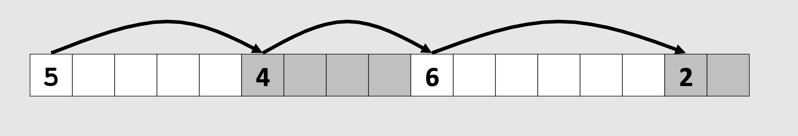
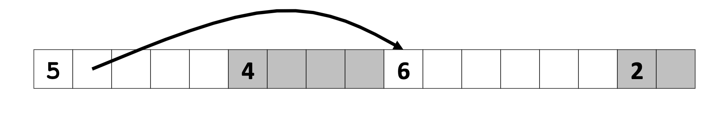
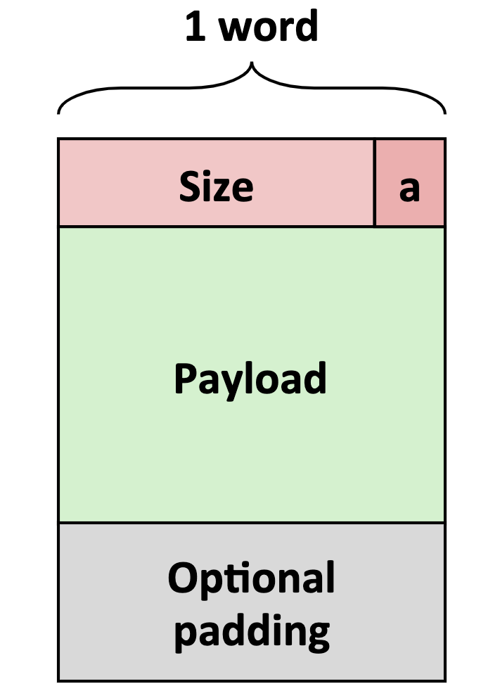
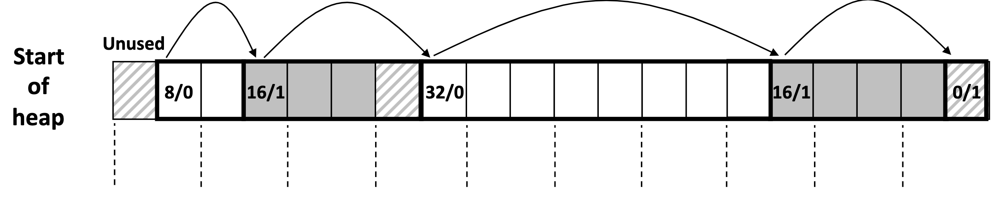
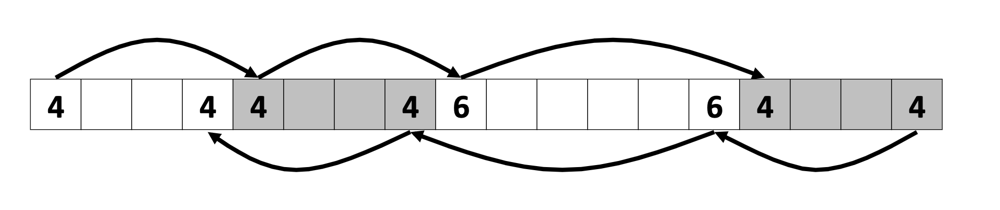

# 动态内存分配
* 基本概念
    * 动态分配内存
        * 程序员在运行时使用动态内存分配（使用malloc）
            * 对于数据结构的大小只有在运行时才能知道

        * 动态内存分配起管理被称为对的进程的虚拟内存区域。

        * 分配器维护堆为可变大小的块，可以被分配或释放

        * 分配的类型
            * 显式的分配
                * 应用程序分配和释放空间，使用malloc或free

            * 隐式分配
                * 应用程序分配，但是不会释放空间， 在java或ML或Lisp中由垃圾回收器回收

            * calloc
                * 将分配的指定大小的区域，初始化为0
            * relloc 
                * 重新分配指定大小分配的区域
            * sbrk
                * 在分配器内部用于堆大小的变大与缩小
            

        * 在这节中做的假设
            * 内存以字为单位的地址
            * 字的大小为4子姐姐

        * 约束
            * 应用程序
                * 可以任意的发送malloc与free的请求
                * free请求必须对以使用的块

            * 分配器
                * 无法控制分配块的大小或个数
                * 必须立即响应malloc请求
                    * 即不能重排序缓冲区请求
                * 必须从空闲区域分配块
                    * 只能在空间内存中放置块
                * 必须对去块，必须满足所有对齐请求
                    * x86（8字节）或x86-64（16字节）的对齐
                * 可以修改空闲内存
                * 不能移动已分配的块

        * 性能目标：吞吐量
            * 给定malloc和free的请求序列
                * R0, R1, R2, RK

            * 目标：最大化吞吐量和最大化内存利用率
                * 这些目标通常有冲突
            * 吞吐量
                * 每单位时间内完成请求的次数

        * 性能目标：最大吞吐率
            * 给定malloc和free的请求序列
                * R0, R1, R2, RK
            * 定义：累积有效负载 $Pk$
                
            * 定义：当前堆大小 $Hk$

            * 定义：k+1请求之后最大吞吐率
                *  $Uk = ( max i<k Pi ) / Hk$ 

        * 碎片
            * 糟糕的内存利用率由碎片引起
                * 内部碎片
                    * 有效载荷小雨块的大小时残生
                    * 原因
                        * 维护堆数据结构的开销
                        * 对齐目的的填充
                        * 显式的策略决定
                    * 只取决于上一次请求的模式
                        * 因此很容易被测量
                * 外部碎片
                    * 堆内存中存在足够大的大小的空闲区域，但是分配了指定大小后会有剩余的区域。
                    * 依赖于未来请求的模式
                        * 很难计量

        * 实现的问题
            * 对于给定的指针，我们如何知道多大的内存需要释放？
            * 我门如何追踪，空闲块？
            * 当要分配的块小于空闲块时，我们该如何处理额外的空间？
            * 如何将一个块用于分配
            * 如何重新插入空闲块
                 
        * 知道需要多少用于释放
            * 标准方法
                * 在块的起始位置处设置块长度信息的字节
                    * 这个字被称为头部
                * 对于被分配的块需要一个额外的字

        * 追踪空闲块
            * 方法1: 隐式列表使用长度-链接所有块
                * 
            * 方法2: 显式的列出-使用指针指向空闲块
                * 
            * 方法3: 分割空闲块
            * 方法4： 根据大小存储块

* 隐式空闲列表
    * 对于每一个块我们需要大小于分配状态
        * 存储于双字党总
    * 标准方法
        * 如果块是对齐的，低位的位总会是0。
            * 如果是8字节对齐，最低的3位会是0，如果是16字节对齐，最低4位是0
        * 总是使用最低位表示是否已经被分配
        * 当读取块的大小时，需要屏蔽地位
        * * 

    * 细节
        * 
        * 寻找空闲块策略
            * 首次适配
                * 从头部开始搜索合适大小的块并选取第一个合适的块
                * 与块的个数是线性时间关系
                * 
            * 下次适配
                * 从上一次查询活动结束地方开始
                * 实际会产生更多的碎片呢

            * 最佳适配
                * 搜索列表，选择最佳的空闲块
                * 保持碎片小-提高了内存使用率
                * 通常运行时间慢于首次适配

        * 分配空闲块
            * 分配空闲块：分割
                * 因为被分配的空间可能小于空闲块，因此需要分割块

        * 释放块
            * 最简单的实现
                * 只释放对应区域，即使总的空闲区域足够，但是因为被分割成了各个小的空闲块根，可能引起无法满足分配空间要求

            * 合并
                * 对释放区域的前和后的空闲区域执行合并处理
                * 但是如何知道释放区域前面的空闲区域的大小？

            * 双向合并
                * 复制大小与分配的字到快的底部
                * 允许我们可以游走于列表
                * 

    * 分配策略总结
        * 