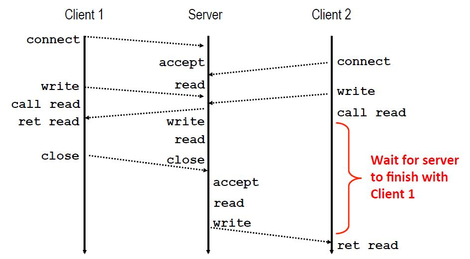
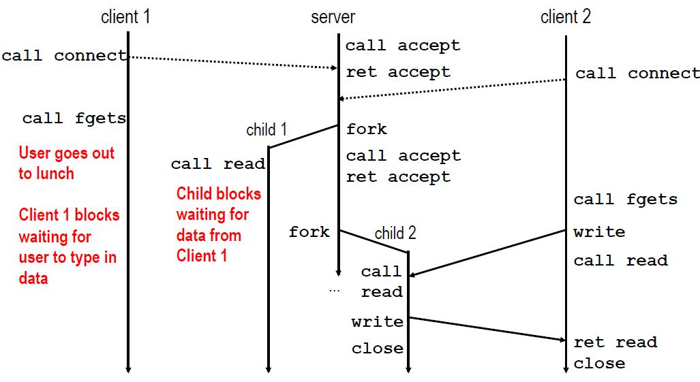
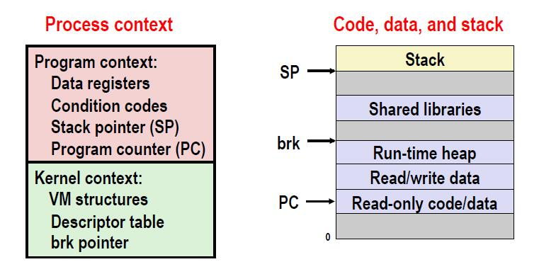
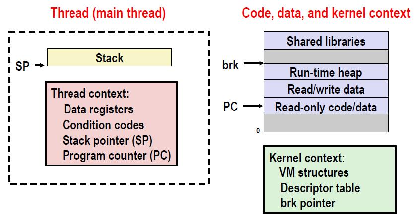
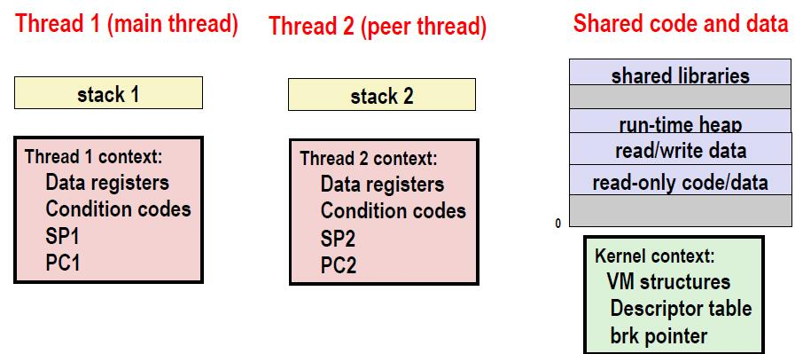
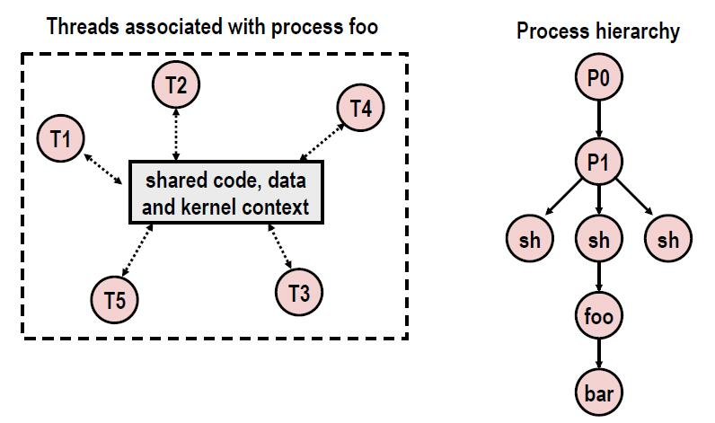
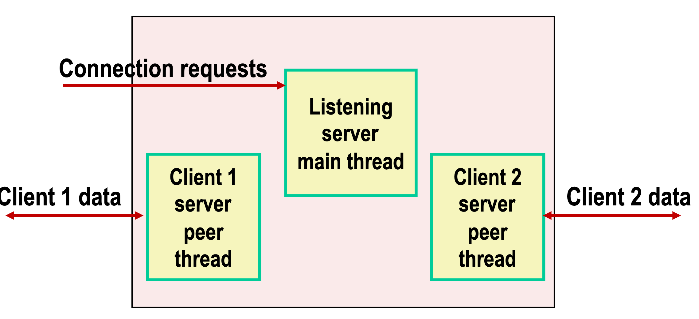

# 第23节 并发编程
* 并发编程难
    * 人的思维倾向于序列型思维
    *   
    * 考虑计算机系统中所有可能的事件序列至少是容易出错的，而且通常是不可能的
 
    * 并发编程的典型问题分类
        * 竞争：结果取决于系统中其他地方的任意调度决策
            * 例子： 谁去的飞机的最后一个位子
        * 死锁：不恰当的资源分配阻碍了前进
            * 例子： 交通堵塞
        * 活锁/饥饿/公正：外部时间或系统调度决定可以预防子任务的处理
            * 例子：有人总是插到你排的队。
    * 迭代服务器的基本流
        * 迭代服务器一次处理一个请求
            * 

    * 写并发服务的方法
        * 允许服务器并发地处理多个客户的
            * 基于进程
                * 内核自动便利多个逻辑流
                * 每个流拥有自己独享的地址空间

            * 基于事件
                * 程序遍历多个逻辑流
                * 所有的流共享相同的地址空间
                * 使用I/O多路复用技术
            
            * 基于线程
                * 内核自动的便利多个逻辑流
                * 每个流共享相同的地址空间
                * 基于超进程与事件

        * 方法1 ：基于进程
            * 

            * 优点
                * 可以并发的处理多个连接
                * 清晰的共享模型
                    * 描述符-不共享
                    * 文件表-共享
                    * 全局变量-不共享
                * 简单且直接

            * 缺点
                * 进程控制的额外开销
                * 进程之间共享数据不简单
                    * 需要IPC（进程间通信）机制
                        * FIFO（PIPE），系统虚拟共享内存与信号

        * 方法2： 基于事件
            * 服务器维护活动连接的集合
            * 重复：
                * 确定哪一个描述符（connfd或listenfd）有挂起的输入
                    * 使用select或epool函数
                    * 到达的挂起的输入是一个事件
                * 如果listenfd有一个输入，则accept连接
                    * 然后将新的conned添加到数组
                * 服务的所有connfd 是挂起的输入

            * 优点
                * 相同的逻辑控制流与地址空间
                * 可以单步调试
                * 没有额外的进程或线程的开销
                    * 高性能web服务与搜索引擎的设计中被采用 Node.js nginx Tornado

            * 缺点
                * 比进程或线程的设计有显著的代码复杂度
                * 无法提供并发
                * 无法充分利用多核
        
        * 方法3: 基于线程
            * 进程的传统视角
                * 进程等于 进程上下文 ， 代码， 数据 ， 栈
                * 

            * 进程的另一个视角
                * 进程等于 线程， 代码，数据与内核上下文
                * 

            * 一个进程的多线程
                * 多个线程可以与一个线程交互
                    * 每个线程有自己的逻辑控制流
                    * 每个线程共享相同的代码，数据，和内核上下文
                    * 每个线程有自己的本地变量栈
                        * 线程栈可以被其他线程访问
                    * 每个线程有自己的线程ID（TID）
                * 

            * 线程的逻辑试图
                * 与进程关联的线程形成对等线程池，与形成树层次结构的进程不同；
                * 

            * 线程对多线程
                * 线程与进程的相似处
                    * 每个都有自己的控制流
                    * 每个可以并发的与其他运行
                    * 每个都是上下文切换
                
                * 不同之处
                    * 线程共享数据，代码（处理本地栈）
                        * 进程不共享
                    * 线程比进程的开销低
                        * 进程控制的成本大约是线程的两倍（根据课程的测试结果）

            * 线程的接口
                * Pthreads: c语言中操作线程的标准接口有60个函数
                * 创建于回收
                    * pthread_create()
                    * pthread_join()
                * 展示自己的线程ID
                    * pthread_self()
                * 终止进程
                    * pthread_cancel()
                    * pthread_exit()
                    * exit() （终止所有的进程）
                * 同步访问共享变量
                    * pthread_mutex_init
                    * pthread_mutex_[un]lock

            * 基于线程的执行模型
                * 
                * 每个客户端由独立的对等线程处理
                * 线程共享所有进程的状态，除了TID
                * 每个进程有独立的本地变量栈

            * 基于线程服务的问题
                * 必须运行在分离模式中避免内存泄漏
                    * 在任意时间点，线程是可连接的活分离的
                    * 可连接的线程可以被其他线程回收和杀死
                        * 必须被回收（pthread_join)以释放内存资源
                    * 分离的线程不可以被其他线程回收和杀死
                        * 资源在终止时可以自动被回收
                    * 默认的状态时可连接的
                        * 使用pthread_detach(pthread_self()) 实现分离
                * 必须小心使用非有意的共享
                * 所有被线程调用的函数必须是线程安全的

