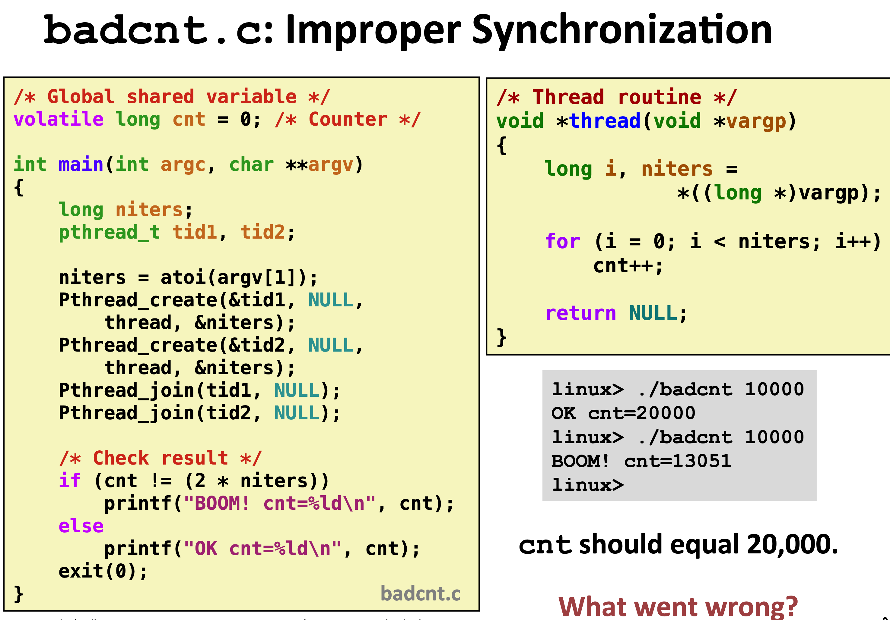

# 第24节 同步基础
* 共享变量在c语言的线程
    * 问题1:哪些变量在C语言的险种中是分享的
    * 定义：当且仅当多个线程引用x的某个实例时，变量x被共享。
    * 答案需要回答下述的问题
        * 什么是线程的内存模型？
        * 内存实例如何映射到内存？
        * 多少个线程引用这些实例？

* 线程内存模型
    * 概念模型
        * 多线程运行于一个进程的上下文中
        * 每一个线程有自己的分离的线程上下文
            * 线程ID， 栈， 栈指针， 程序计数器，状态吗，寄存器
        * 所有线程共享剩余的进程上下文
            * 代码，数据，堆，堆指针，共享库，虚拟地址空间
            * 打开文件与安装的处理器

        * 实际，这个模型没有严格的实施
            * 寄存器是真正被分割里保护
            * 任意线程可以读和写其他线程的栈

    * 映射变量实例到内存
        * 全局变量
            * 定义：定义在函数外部的变量
            * 虚拟内存中只有一个全局变量的实例
        * 本地变量
            * 定义：在函数内定义的：（不包括static）的变量
            * 每个线程栈保存每个本地变量的实例
        * 本地静态变量
            * 定义：定义在函数内部的（static）变量
            * 虚拟内存中只有一个本地静态变量的实例

* 同步线程
    * 
    * 原因：对于全局变量没有加同步处理，多线程在处理全局变量是出现与预期结果不一致问题
            

    * 进度图
        * 在x轴和y轴定义线程操作的点
        * 不安全区域
            * 

            * 程序的步骤经过不安全区域时引发线程问题

            * 解决方法 ： 在对共享变量操作之前实行同步处理（信号量）
        
    * 信号量
        * 非负数的整型全局同步变量。被P（测速）和C（更新）处理
        * P（s）
            * 如果s是非零，则减1并快速返回
                * 测试与减一处理是原子的
            * 如果s是0则挂起进程直到变成非零切线程重启与V操作
            * 重新开始后，P操作减少s并返回控制权给调用者

        * V（s）
            * 对s做加1操作
                * 加操作是自动的
            * 如果有任意线程阻塞在P操作并等待s变成非零，则重新启动等待中的一个线程，然后完成p操作并减1

        * 基本思想
            * 将唯一的信号量初始于1，并在每个共享变量中
            * 在关键区域的前后设置p和v操作
