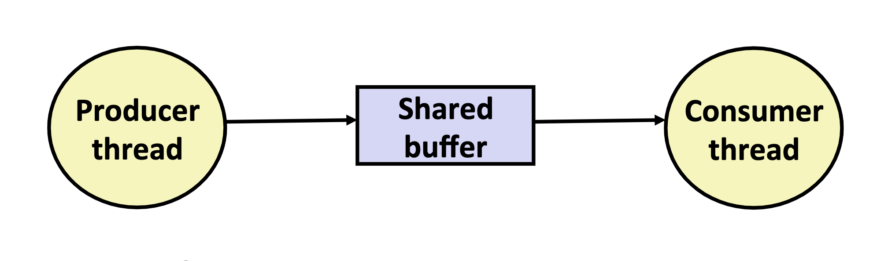
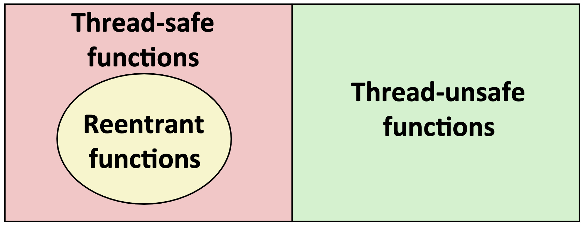

# 第25节 同步高级
* 使用信号量协调对共享变量的访问
    * 基本思想：线程使用信号量操作，提示其他线程某些状态发生了变化
        * 使用计数信号量追踪资源的状态和提示其他线程
        * 使用mutex（二元信号量）保护资源的访问

    * 两种典型例子
        * 生产者消费问题
        * 写者和读者问题

* 生产者-消费者问题
    * 
    * 经典同步模式
        * 生产者等待空的槽位，插入元素到缓冲区，并且给消费者发送信号
        * 消费者等待元素，并从缓冲区中删除元素，并且给生产者发送

    * 例子  
        * 多媒体处理
        * 事件驱动徒刑用户接口

    * N元素缓冲区上的生产者消费者
        * 需要一个二元信号量和两个计数信号量
            * mutex（二元信号）：强制对缓冲区的互斥访问
            * slots（槽位信号）：记录缓冲区中的可用槽位
            * items（元素信号）：记录缓冲区中可用的元素
        * 通过共享缓冲包实现sbuf  教材P705 P706
* 写者-读者问题
    * 互斥问题的泛化
        * 问题描述
            * 读线程只读取对象
            * 写线程修改对象
            * 写者必须排他的访问对象
            * 无限制个数的读者可以访问对象
        * 在真实系统中经常发生
            * 飞机预定系统
            * 多线程缓存Web代理

    * 读者-写者问题的变种
        * 优先读后写问题
            * 读者不需要等待除非写者已经被赋予使用对象的权限
            * 在等待的写入者之后到达的读取器优先于写入者
        * 优先写后读的问题
            * 一旦写者准备写入，则尽可能快速的写
            * 读者的到达优先于写者但是必须等待写者
        * 饥饿 可能在上述两种情况中皆可发生
            * 读者或写者一直等待

* 线程安全
    * 被线程调用的函数必须是线程安全的
    * 定义：一个函数是线程安全的即在多个并发线程调用时能够产生正确的结果

    * 非线程安全分类
        * 类1：函数不保护共享变量
            * 使用加锁的方式可以解决
        * 类2：函数在多线程的调用中保存状态
            * 例子：随机数生成器每次生成的结果依赖于静态的上一次函数调用的结果
            * 解决方法：重写为线程安全的函数
        * 类3：函数返回的指针指向静态变量
            * 
            * 解决方法：加锁并复制要返回的结果
        * 类4：函数调用非线程安全函数

    * 可重入函数
        * 定义：在并发线程中一个函数是可重入的是该函数不访问共享变量
        * 可重入与线程安全的关系
            * 

    * 线程安全函数库

* 并发产生的问题
    * 竞争：当一个程序的正确性依赖于一个线程要在另一个线程到达y点之前到达它的控制流中的x点时，就发生竞争
    * 死锁：一个处理如果等待一个永远不会变为真的条件时产生
        * 处理1 处理2 需要两个资源A和B
            * 处理1 对A加锁，并等待B
            * 处理2 对B加锁，并等待A
            * 两者都无法得到资源
