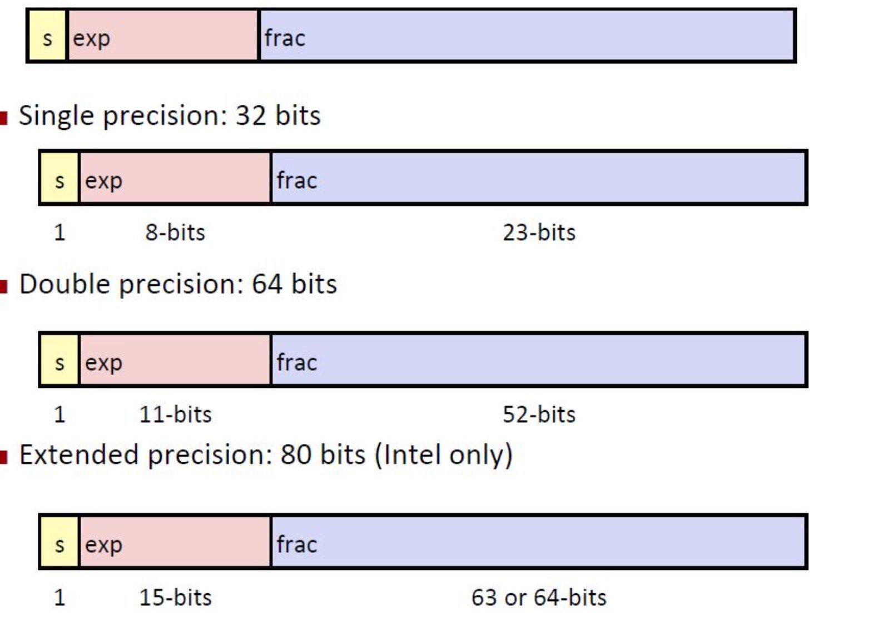

# 第四节
* 参考( http://doraemonzzz.com/2020/05/09/CMU%2015-213%20Intro%20to%20Computer%20Systems%20Lecture%204/#%E6%B5%AE%E7%82%B9%E6%95%B0%E4%B9%98%E6%B3%95%E7%9A%84%E6%95%B0%E5%AD%A6%E6%80%A7%E8%B4%A8)
*  IEEE浮点数表示
    *  公式：$（-1）^s * M * 2^E $
        * s 表示符号位
        * M 表示尾数 ， 是一个二进制小数 范围在0-1（接近） 或者 1-2（接近）
        * E 表示浮点数加权

    * 结构
        * 图示
        * 
    * 分类
        * 规范化的值
            * 当exp（阶码位）的位表示不全是0或1时。
            * E的计算公式： $ e-Bias $
                * e 为位表示的无符号整数值。
                * Bias 为 $ 2^(k-1) -1 $  k为表示exp区使用的二进制位数
            * M （小数位）的计算公式: $ 1 + f $ 
                * f 为frac区的位表示的小数的值

        * 非规范化的值
            * 当exp的位表示全是0000是。
            * E的计算公式： $ 1-Bias $
                * Bias 为 $ 2^(k-1) -1 $  k为表示exp区使用的二进制位数
            * M 的计算公式: $ f $ 
                * f 为frac区的位表示的小数的值

        * 特殊值
            * 当exp的位表示全部为1时
                * 小数位全部位0时表示无穷
                * 小数位的域为非零时表示NaN（不是一个数）
* 舍入
    * 四种舍入
        * 向偶数舍入 默认舍入方式
        * 向零舍入
        * 向下舍入
        * 向上舍入
        * 
* 浮点运算
    * 基本思想
        * $ x*y = Round(x*y) $
        * $ x+y = Round(x+y) $
    * 乘法 
        * $ ((-1)^s1 * M1 * 2^E1) * ((-1)^s2 * M2 * 2^E2)  $
        * 符号位 s1 ^ s1;
        * 尾数 M1*M2
        * 阶码位 E1+E2

        * 浮点数乘法计算的性质
            * 满足交换律
                * $ x+y = y+x $
            * 不满足结合律
                * $ x(y+z)  != x*y + x*z $

            * 乘法运算向下封闭 

            * 单调性
    * 加法 
        *  $ ((-1)^s1 * M1 * 2^E1) + ((-1)^s2 * M2 * 2^E2)  $
        * 符号位s ， 尾数M：对齐加法结果
        * 阶码 E：E1

        * 数学性质
            * 加法运算向下封闭 
            * 满足交换律
            * 不满足结合律
            * 0 是加法元

        * 单调性

