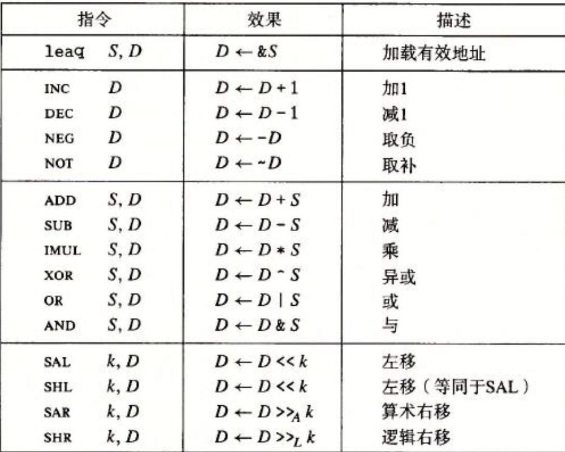
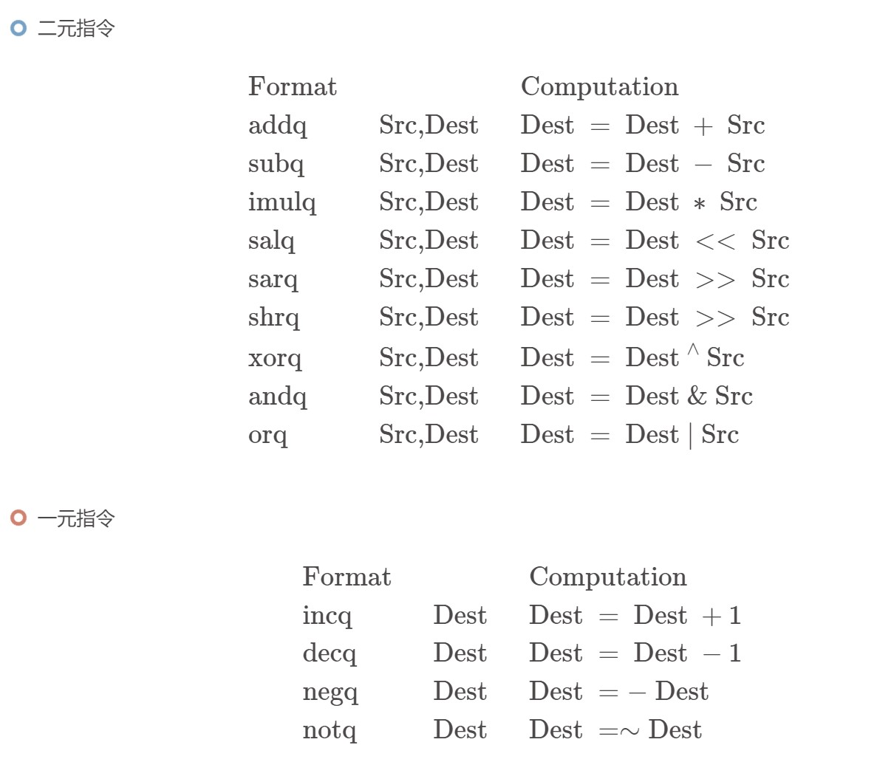

# lecture 5 machine level programing

*  intel x86 processor
    * cisc 复杂指令集
    * risc 精简指令集

* c 汇编 机器语言
    * 汇编 机器代码视图
        * 计数器
            * 下一个指令地址
        * 寄存器
            * 寄存器文件包含16个命名的位置，分别存储64为的值。
            * 可以存储地址或整数数据。
                * 有的可以记录程序状态，其他可以保存临时数据，参数或局部变量。
        * 条件码寄存器    
            * 保存着最近执行的算术或逻辑指令的状态信息，用来实现控制或数据流的条件变化。
        * 内存
            * 字节数组地址
            * 代码以及数据
            * 

    *   C 转换到 Object Code   
        * 编译指令 gcc -O g p1.c p2.c -o p
        * 过程
            * C 代码编译后，生成p1.s p2.s
            * Asm 代码编译， 生成p1.o p2.o
            * Object Program文件使用链接，将多个o文件合成到一个可执行文件。
        
        * c到汇编
            * gcc -Og -S sum.c
                * 此指令的意思位sum.c文件只编译到汇编文件生成为止。
        
        * 汇编的数据类型
            * 整数
                * 1，2，4，8 字节
            * 浮点数
                * 4，8 10 字节
            * 码  字节序列编码一系列的指令
            * 非整合类型，例如数组或结构体
        * 汇编操作
            * 在寄存器或内存当中的数学运算函数
            * 相互之间传输数据在内存和寄存器
            * 传输控制
                * 

        * Object Code
        
        * 机器指令例子
            * 

        * 反汇编ObjectCode
            * objdump -d sum
            * gdb 
    * 数据格式
        * 术语
            * word 表示16位数据类型
            * double word 表示32位数据类型
            * quad word 表示64位数据类型
        * 大多是指令代码都有一个后缀，表明操作数的大小
        *   | c 声明      | Intel数据类型 | 汇编代码后缀 | 大小（字节） |
            | ----------- | ----------- |----------- |----------- |
            | char      | 字节       | b | 1       |
            | short     | 字         | w | 2       |
            | int       | 双字       | l | 4       |
            | long      | 四字       | q | 8       |
            | char *    | 四字       | q | 8       |
            | float     | 单精度     | s | 4       |
            | double    | 双精度     | l | 8        |
    * 汇编基础
        * %r开头的表示寄存器。
        * 移动数据
            * 3种pattern
                * 用语 
                    * imm 立即值 在c中为常量
                    * reg 寄存器 可以理解为一个临时的值
                    * mem 内存
                * | src      | dest | assm | c |
                  | ----------- | ----------- |----------- |----------- |
                  | imm      | Reg       | movq $0x4 %rax | temp = 0x4       |
                  | imm      | Mem        | movq $-147 (%rax) |*p = -147       |
                  | Reg      | Reg       | movq %rax %rdx |temp2 = temp1       |
                  | Reg      | Mem        |movq %rax (%rdx) |*p = tmp       |
                  | Mem      | Reg       |movq (%rax) %rdx | temp = *p       |

            * mov指令由四条指令组成，movb，movw，movl，movq。分别表明移动数据大小，1字节，2字节，4字节，8字节。
            * movabsq指令能够以任意64位立即数作为源操作数，并且只能以寄存器作为目的
            * 寄存器的大小分别与最后一个字符b，w，l，q指定的大小匹配。
            * movl指令以寄存器位目的地时，他会把寄存器的高四字节设置为0。
            * 将较小的源数据复制到较大的目的时使用movz和movs
                * movz类中指令目的中的字节填充位0
                * movs类中的指令通过符号扩展来填充，吧源操作的最高位进行复制
                * 后面还会跟着只是大小的两个字符 bw bl等，表明1字节的源复制到2字节的目的中。详细参考P123页，
        
        * 操作数指示符
            * 三种类型
                * 立即数
                    * 用来表示常数值，以$开头 $0x33
                * 寄存器   
                    * 表示某个寄存器的内容
                    * 用rα表示 R\[rα\]
                * 内存引用
                    * 访问某个内存位置
                    * 符号Mb表示
                    * 最常用的寻址形式 Imm(rb, ri, s) 可用 Imm + R\[rb\] + R\[ra\] * s 
                        * rb 表示基址寄存器
                        * ri 变址寄存器
                        * s 必须是1，2，4 或8
                        * imm为立即数偏移量

                    * 

        * 压入和弹出栈数据
            * 操作数$rsp保存着栈顶元素的地址。
            * 程序栈的顶时栈在内存中的地址的值最小。
            * pushq 
                * 向程序栈压入大小位8字节的数据。
            * popq
                * 从程序栈中取出栈顶数据。

        * 算数和逻辑操作
            * 图示
                * 
            * leaq 指令（加载有效地址）
                * 用途
                    * 将有效地址写入到目的当中。
                        * & 操作符 用于取变量的内存地址
                    * 还可以进行简洁的算术操作
                        * leaq 7（%rdx， %rdx， 4）， %rax 
                        * 为 %rax设置 5%rdx的值+7；
                * leaq src dest
                * 其中目的必须是寄存器
            
            * 一元和二元操作
                * 

