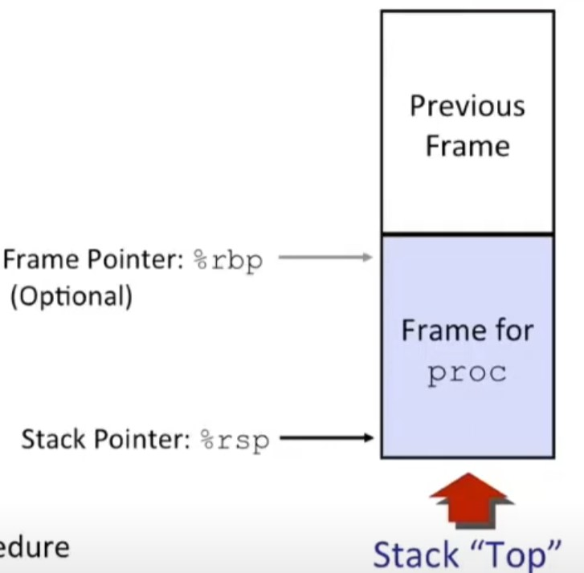

# lecture 6 machine level programing 3 Procedures

* x86-64 栈

    * 向栈中添加数据在内存中的操作是降低栈指针（%rsp）的值。反之亦然。
    * 压栈
        * pushq src
            * 将%rsp减8.
            * 在给定的地址%rsp处写入操作数（src的值）。
    * 出栈
        * popq dest
            * 取出栈顶的值。
            * 将栈指针（%rsp）加8
            * 将取出的值写入到dest（目的寄存器）中。

* 转移控制
    * 过程控制流
        * 利用栈来支持过程的调用与返回
        * 调用 call label
            * 将返回地址压入栈顶
            * 跳跃到label的地址
        * 返回地址
            * 返回地址即为call指令执行后的下一个指令地址。
        * 返回 ret
            * 从栈顶中取出返回地址。
            * 跳跃到返回地址当中。

* 数据传输
    * 参数的传递通过6个寄存器实现。
    * 如果参数个数超过6个，则使用栈来存储剩余的参数。
    *   | 寄存器      | 解释 | 
        | ----------- | ----------- |
        | %rdi      | 第1个参数     | 
        | %rsi      | 第2个参数     | 
        | %rdx      | 第3个参数     | 
        | %rcx      | 第4个参数     | 
        | %r8      | 第5个参数     | 
        | %r9      | 第6个参数     | 
        | %rax      | 返回值     | 

* 管理本地数据
    * 基于栈的语言
        *  C Pascal Java
        * 代码必须可重入
            * 多个同步实例的单个过程
        * 在一些区域保存各个实例的状态
            * 参数
            * 本地变量
            * 返回指针

        * 栈的约定
            * 给定过程的状态只需限定的时间
                * 从被调用到返回
            * 被调用者的返回在调用者之前
        * 栈帧
            * 单个过程保存的状态。
    
    * 栈帧
        * 栈帧保存的内容
            * 返回信息
            * 本地存储（如果需要）
            * 临时空间（如果需要）

        * 管理
            * 当进入到过程中时，空间会被分配。
                * “Set-up” code
                * 包括call指令
            * 当返回时，空间会被释放
                * “Finish” 代码
                * 包括 ret指令
        * 

    * x86-64/Linux栈帧
        * 当前栈帧
            * 参数构建 为了调用过程而事先在栈中构造好。
            * 本地变量 如果在寄存器不够保存时在栈中保存
            * 保存寄存器的上下文（可以在被调用过程中随意修改的寄存器 %rbp等）
            * 旧的栈指针（可选的）
        
        * 调用者栈帧
            * 返回地址
                * 在call指令中压入栈
            * 为了调用其他过程而准备的参数。

    *  寄存器保存惯例
        * 调用者需要在执行调用之前保存临时数据到栈帧中。
        * 被调用者需要在执行被调用过程之前保存临时数据在他的栈帧中。
        * 被调用者在返回之前从栈帧中恢复临时数据。

    * x86-64 linux 寄存器 使用
        * %r10 %r11 
            * 调用者保存
            * 可以被其他的过程修改
            
        * %rbx %r12 %r13 $r14
            * 被调用者保存
            * 被调用者必须保存与恢复
        
        * %rbp
            * 被调用者保存
            * 被调用者必须保存与恢复
            * 有可能用于帧指针
            * 可以mix且match
        
        * %rsp 
            * 特殊形式的被调用者保存
            * 退出程序后恢复到原始值

* 递归调用
    * 