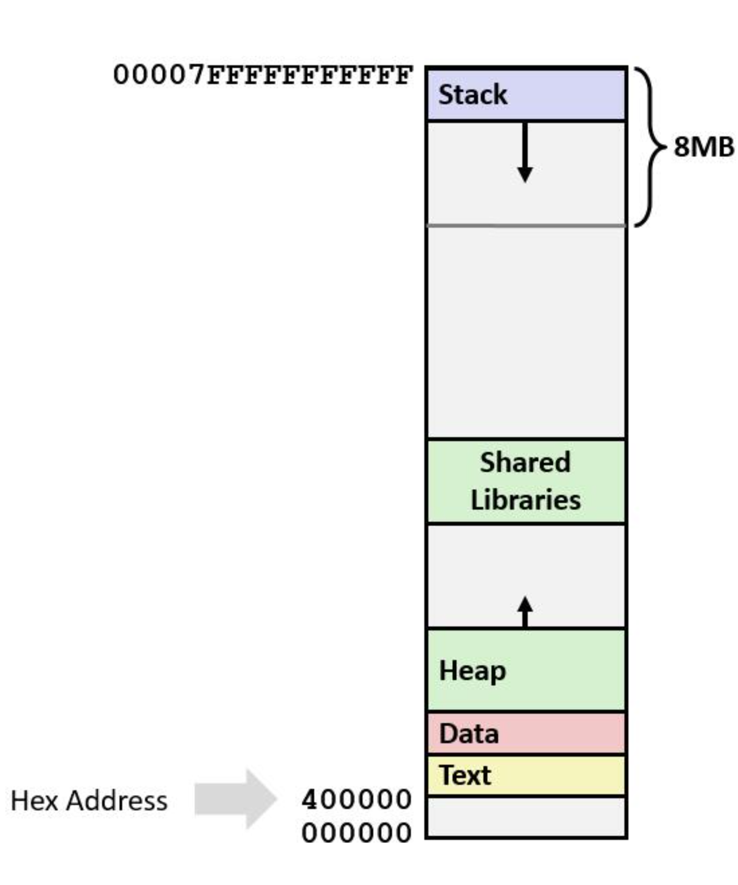
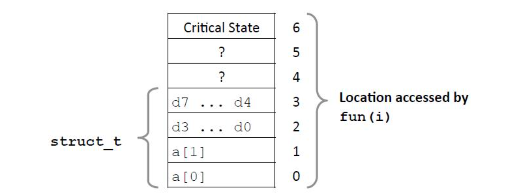
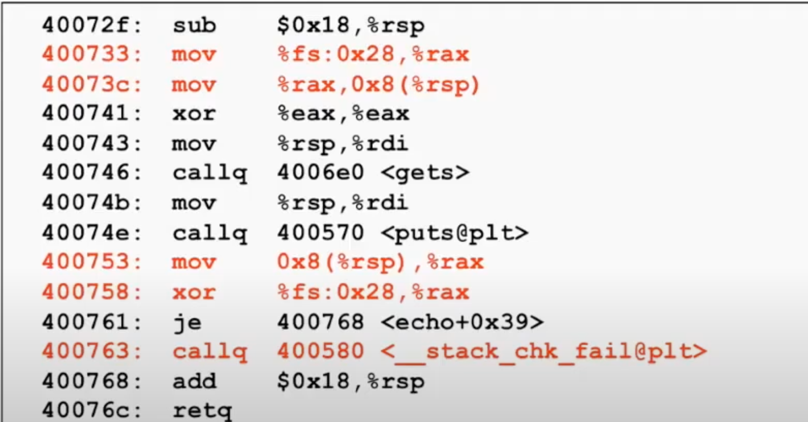
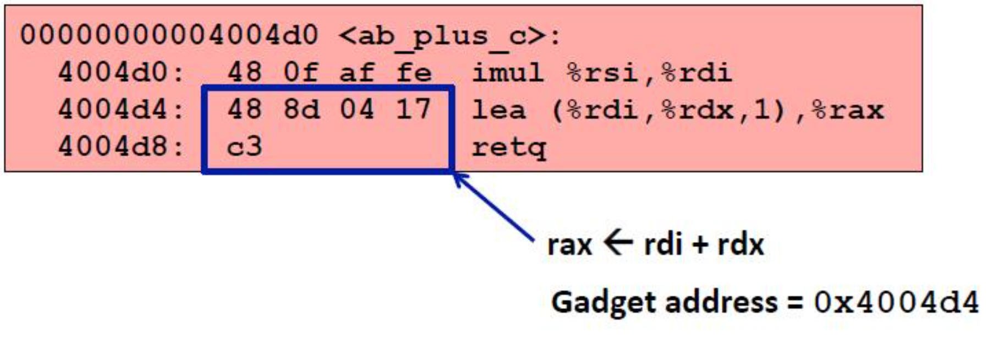

# 数据表述
* 内存布局
    * 栈   
        * limit指令可查看栈的大小
        * 运行时用的栈 大小为8Mb 
        * 本地变量
    * 堆
        * 动态分配内存区
        * 当使用malloc（） 或calloc（） new 时被分配的内存区域。
    * 数据
        * 静态分配的区域
        * 全局变量，静态变量， 字符串常量等
    * 文本区/共享库
        * 可执行机器指令
        * 只读

    * 图示
        * 

* 缓冲区溢出
    * C 
    ```
        typedef struct{
            int a[2];
            double b;
        } struct_t;

        double func(i){
            volatile struct_t s;
            s.d = 3.14;
            s.a[i] = 1073741824;
            return s.d;
        }
    ```
    *  CODE
    ```
        fun(0) ➙ 3.14
        fun(1) ➙ 3.14
        fun(2) ➙ 3.1399998664856
        fun(3) ➙ 2.00000061035156
        fun(4) ➙ 3.14
        fun(6) ➙ Segmentation fault
    ```

    * 内存布局如下
        * 

    *  上述现象会产生大问题
        * 当超过了数组被分配的大小时，会修改超出部分的值。
    * 为什么是个大为题
        * 会引发安全漏洞
            * 总体原因是社会工程与用户忽视
    * 通常的形式
        * 为检查输入字符串的大小
        * 尤其字符数组在栈区时
            * 有时称为stack smashing

    * 例子
        * 
        ```
            /* Echo Line */
            void echo()
            {
                char buf[4]; /* Way too small! */
                gets(buf);
                puts(buf);
            }

            void call_echo() {
                echo();
            }
        ``` 

        * 执行
        ```
            unix>./bufdemo-nsp
            Type a string:012345678901234567890123
            012345678901234567890123
        ```

        *  执行
        ```
            unix>./bufdemo-nsp
            Type a string:0123456789012345678901234
            Segmentation Fault
        ```

        *    反汇编如下
        ```
            00000000004006cf <echo>:
            4006cf: 48 83 ec 18 		sub $0x18,%rsp
            4006d3: 48 89 e7 			mov %rsp,%rdi
            4006d6: e8 a5 ff ff ff 		callq 400680 <gets>
            4006db: 48 89 e7 			mov %rsp,%rdi
            4006de: e8 3d fe ff ff 		callq 400520 <puts@plt>
            4006e3: 48 83 c4 18 		add $0x18,%rsp
            4006e7: c3 				    retq
        ```

        * 在栈中创建了24字节的大小可以保存数据，输入字符超过24时就会修改过程返回地址的值，当echo结束后读取返回地址的值时因为值被污染过


    * 代码注入攻击

    * 蠕虫与病毒的区别
        * 蠕虫可以自己运行，并不断复制自己

        * 病毒是攻击某一个程序后，改变原程序的行为。
    
    * 避免缓冲区溢出
        *  使用限制写入缓冲区的函数 如 strncpy fgets 
        *  栈随机化
            * 在程序开始时随机分配栈中的空间
            * 对于整个程序移动栈地址
            * 令黑客难以预测插入代码的点
        * 不可执行代码的区域
            * 过去的x86只有可读与可写两种区分，可读的代码即是可执行的。
            * 增加了可执行的符号位，只有可执行的代码具有被执行的权限
        * 金丝雀
            * 在调用程序之前时在栈的一个区域写入随机值。
            * 在程序退出之后检查随机值是否相同，如果不同则终止
            * 默认是追加了金丝雀机制。
            * 
    
    * 面向返回编程的攻击    
        * 挑战
            * 栈的随机化使得很难预测缓冲区的位置
            * 不可执行的栈标记使得很难插入二进制编码

        * 策略
            * 利用终止代码
                * 来自标准库代码
            * 将多个部分组合在一起，使得达到最终期望的结果
            * 不会修改金丝雀的值

        * 构建gadgets的编程
            * 一系列的ret指令
                * 被编码为0xc3
            * 每次运行固定的代码位置
            * 代码是可执行的

        * gadget例子
            * 

    * unions
        * 声明方式有点类似结构体，但是存储数据时，只保留字段中的最大字节大小的空间。