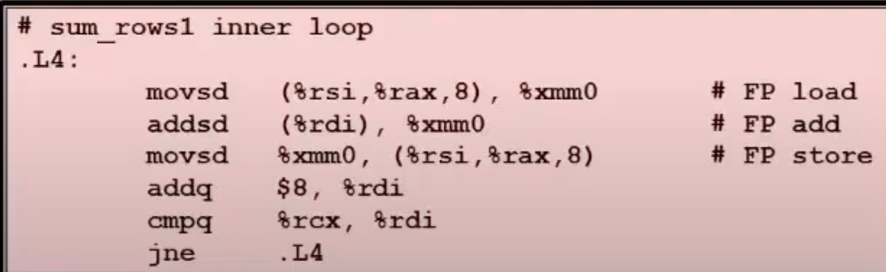
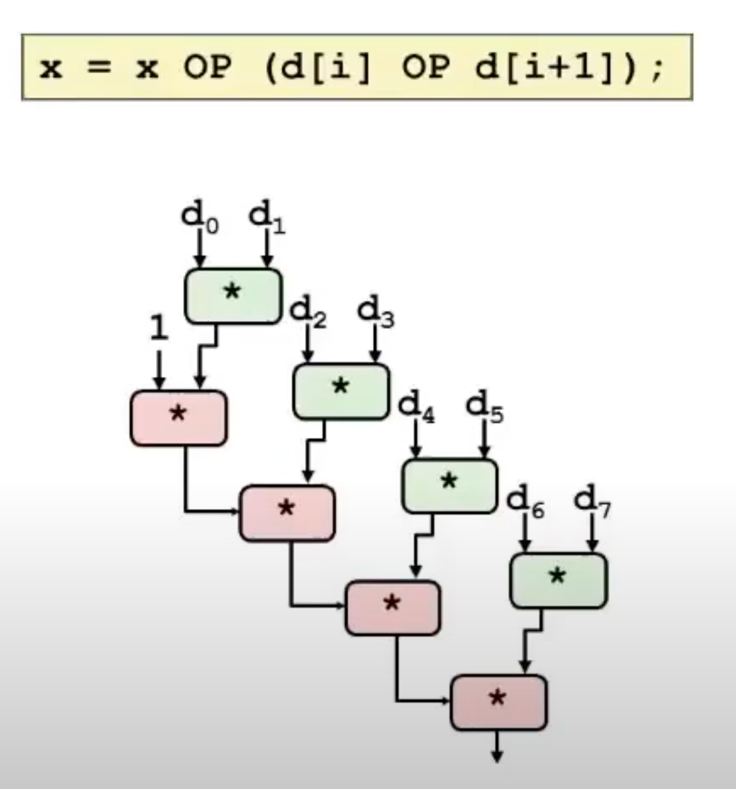
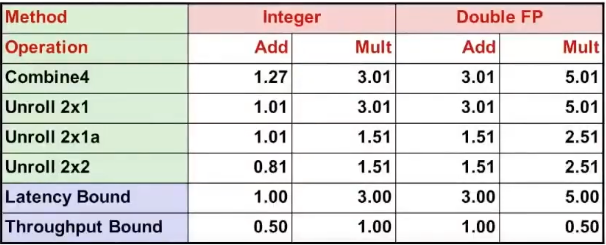
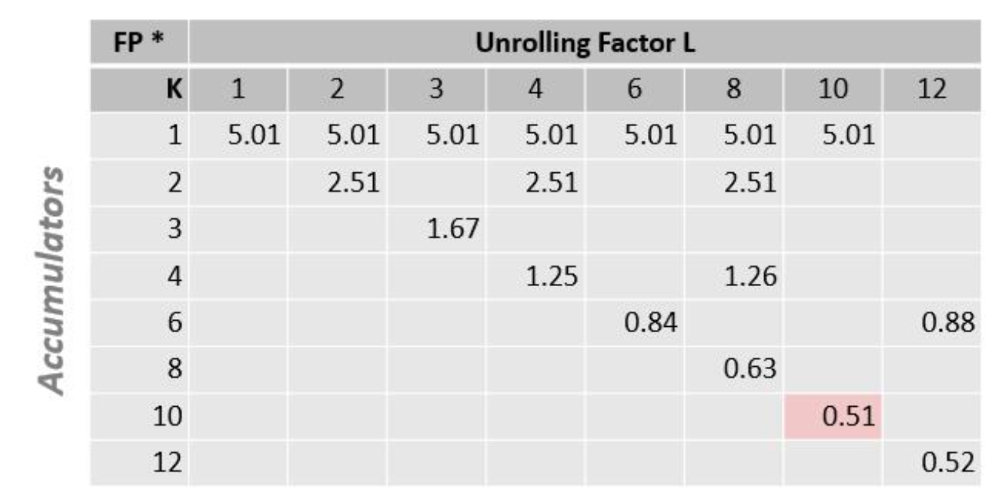

# 程序优化
* 总揽
    * 性能不仅仅是渐进复杂度
    
    * 常数因子也很重要
        * 根据代码编写方式很容易看大10：1的性能范围
        * 优化必须在多个层面执行
            * 算法， 数据表示， 循环， 过程
    
    * 为了优化性能必须理解系统
        * 程序是如何被编译且被执行的
        * 现代处理器与内存系统操作
        * 测试程序的性能与识别瓶颈
        * 在不破坏代码的模块性的前提下如何提升性能

    * 编译器优化的局限性
        * 在基本约束下运作
            * 不应该引起程序行为的任何变化。
                * 除了程序可能使用了非标准语言特征时
                * 
        * 语言和编码风格可能会混淆对程序员而言显而易见的行为
            * 数据的范围超过了变量类型的范围

        * 大多数分析仅在程序内进行 

        * 大多数分析是仅基于静态分析

        * **如有疑问，编译器必须是保守的**

* 通用的优化方法

    * 代码移动
        * 减少执行计算的频率
            * 当每次计算的结果都相同时，将其保存到临时变量里保存。

        * 修改前 
        ```
            void set_row(double * a, double * b , int i , long n){
                long j ;
                for (j = 0; j < n ; j++){
                    a[n*i+j] = b[j];
                }
            }
        ```

        * 修改后
        ```
            void set_row(double * a, double * b , int i , long n){
                long j ;
                int ni = n*i;
                for (j = 0; j < n ; j++){
                    a[ ni+j] = b[j];
                }
            }
        ```

    * 强度降低
        * 成本大的操作替换成简单的操作
        * 用位移操作题传乘法与除法
        * 识别乘法顺序
            * 

    * 共享常用子表达式
        *  修改前
        ```
            /* Sum neighbors of i,j */
            up =    val[(i-1)*n + j  ];
            down =  val[(i+1)*n + j  ];
            left =  val[i*n     + j-1];
            right = val[i*n     + j+1];
            sum = up + down + left + right;
        ```

        * 修改后
        ```
            long inj = i*n + j;
            up =    val[inj - n];
            down =  val[inj + n];
            left =  val[inj - 1];
            right = val[inj + 1];
            sum = up + down + left + right;
        ```

    * 优化阻止者1 函数调用
        * 减少循环调用返回结果相同的函数
            * strlen 在每一次循环中的结果都一致。
            * 改进措施为将函数调用结果保存在临时变量中
            * 代码
            ```
                void lower (char *s)
                {
                    size_t i;
                    for (i = 0; i < strlen(s); i++)
                    {
                        if( ).....
                    }
            
                }
            ``` 

            * 编译器对函数调用的优化很有限，编译器无法确定每一次函数的返回值相同，因此编译器对与函数的态度是将其视为一个黑箱。
        
    * 优化2 内存引用
        *  示例
        ```
            void sum_row(double * a, double * b , long n){
                long i j ;
                for (i = 0; i < n ; i++){
                    b[i] = 0;
                    for( j = 0 ; j < n ; j++)
                         b[j] += a[n*i+j];
                }
            }
        ```
        * 

        * 在内循环中反复读取b[j]的值，并对其进行更新，影响程序性能
        * 改进措施为将累加的结果保存在临时变量后，内循环结束后更新到b[j]中。

        * 内存别名
            * 编译器对sum_row做有限的优化的理由之一为，内存别名的可能性，当b指向的内存地址与a相同时运算的结果与优化后的结果不同。
                * 
                ``` 
                    double a[9] ={0,1,2,4,8,16,32,64,128}
                    double b[3] = a+3
                    // 此时如果调用sum_row
                    b init 4,8,16
                    i = 0  3, 8, 16
                    i = 1  3,22,16 
                    i = 2  3,22 
                ```

        * 因为内存别名的可能，编译器会做保守的处理，即翻译为代码的执行功能，不会对其优化到使用临时变量。
        * 需要人为的将其修改为能够执行优化的代码。

    * 利用指令级并发处理
        * 硬件可以同时执行多个指令。
        * 性能受到数据的依赖限制， 比如等待上一次处理的结果等。
        

        * CPE （每个元素的周期数）
            * 描述性能的指标
            * 

        * 现代CPU模型
            * 
            * 详细的执行过程说明 P367
            
        * 超标量处理器
            * 定义： 超标量处理器可以在一个周期内发出并执行多条指令。 指令是从顺序指令流中检索的，通常是动态调度的。
            * 优点： 不需要编程，超标量处理器可以利用指令级并行的优点。
            * 大多数现代处理器都支持超标量

            * 例子
                * 
                ```
                    long mult_eg(long a, long b, long c) {
                        long p1 = a * b;
                        long p2 = a * c;
                        long p3 = p1 * p2;
                        return p3;
                    }
                ```

                * 将计算分为阶段。
                * 在各个阶段执行一部分的计算
                * 一旦值传递给 $ i+1 $，就可以开始新的计算阶段
                * 例如 即使每个浮点数乘积需要3个周期，也可以在7个周期内完成。
                    * 如图示中展示的那样，使用流水线化的方法将多个指令并行的执行。
                * 图示
                    * 

                * combine4 的汇编
                    * 

                    * 每次循环时t的计算结果需要等待上一次t的计算结果，此部分影响了整体的性能。优化方案可以使用循环展开与，t计算过程重排。

                * 循环展开
                    * 实现思路为，在每次循环中执行多次操作。

                    * 代码
                        ```
                            void unroll2a_combine(vec_ptr v, data_t *dest)
                            {
                                long length = vec_length(v);
                                long limit = length-1;
                                data_t *d = get_vec_start(v);
                                data_t x = IDENT;
                                long i;
                                /* Combine 2 elements at a time */
                                for (i = 0; i < limit; i+=2) {
                                    x = (x OP d[i]) OP d[i+1];
                                }
                                /* Finish any remaining elements */
                                for (; i < length; i++) {
                                    x = x OP d[i];
                                }
                                *dest = x;
                            }
                        ```
                    * 效果
                        
                
                * 重新结合
                    *  修改了括号的位置，将i个元素与i+1个元素的计算先执行。此处正是利用了并行处理的优势，将两个处理先并行处理后与x在做计算。
                    * 代码
                    ```
                        void unroll2aa_combine(vec_ptr v, data_t *dest)
                        {
                            long length = vec_length(v);
                            long limit = length-1;
                            data_t *d = get_vec_start(v);
                            data_t x = IDENT;
                            long i;
                            /* Combine 2 elements at a time */
                            for (i = 0; i < limit; i+=2) {
                                x = x OP (d[i] OP d[i+1]);
                            }
                            /* Finish any remaining elements */
                            for (; i < length; i++) {
                                x = x OP d[i];
                            }
                            *dest = x;
                        }
                    ```
                    * 图示
                        * 

                    * 限制
                        * 如果OP满足结合律，这种修改方法没有问题。（整形的加算与乘积符合结合律，浮点数不满足结合律）。
                        * 
                
                
                * 重新结合2 
                    * 代码
                        ```
                            void unroll2a_combine(vec_ptr v, data_t *dest)
                            {
                                long length = vec_length(v);
                                long limit = length-1;
                                data_t *d = get_vec_start(v);
                                data_t x0 = IDENT;
                                data_t x1 = IDENT;
                                long i;
                                /* Combine 2 elements at a time */
                                for (i = 0; i < limit; i+=2) {
                                x0 = x0 OP d[i];
                                x1 = x1 OP d[i+1];
                                }
                                /* Finish any remaining elements */
                                for (; i < length; i++) {
                                    x0 = x0 OP d[i];
                                }
                                *dest = x0 OP x1;
                            }
                        ```
                    * 效果
                        

                * 展开与结合总结
                    * 思路
                        * 可以展开任意深度到L
                        * 可以在并行的结合K个结果
                        * L必须是K的倍数

                    * 限制
                        * 无法超越执行单元的吞吐量限制
                        * 短时开销大
                            * 按顺序完成迭代

                    * 极限效果
                        * double * 
                            * 

                        * int + 
                            * * 
        
        * 分支预测
            * 理念
                * 猜测分支将走哪条路
                * 开始在预测位置执行指令
                     * 实际上不修改寄存器或存储器。 只有当认为结果与预测相符时更新寄存器。 
            
    * 程序性能检测工具
        * gprof 