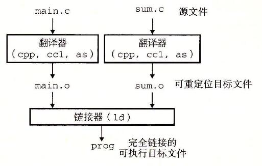
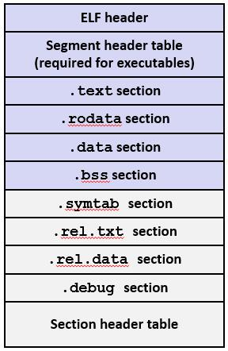
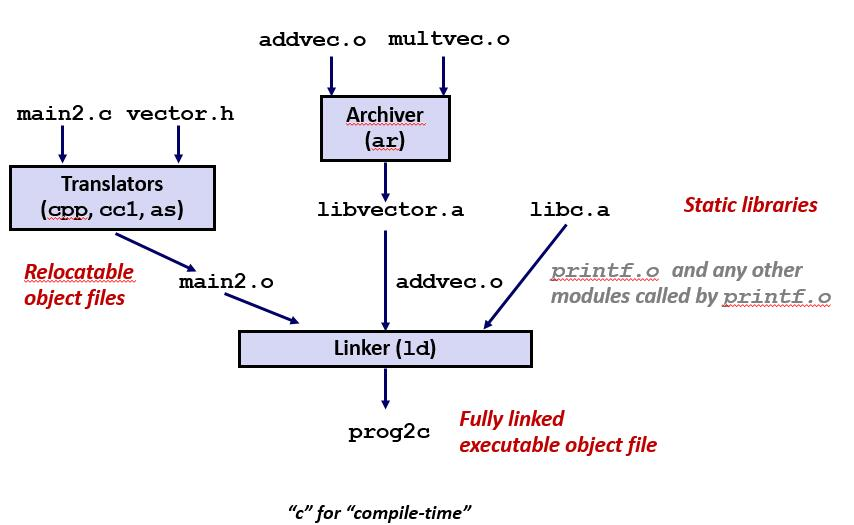
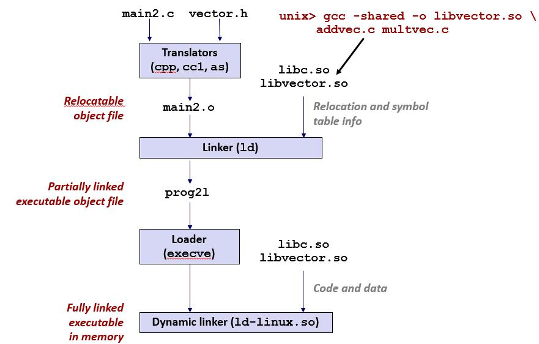

# 链接

## C程序例子
* 两个C程序
    * main.c
    ```
        int sum(int *a, int n);

        int array[2] = {1, 2};

        int main()
        {
            int val = sum(array, 2);
            return val;
        }
    ```

    * sum.c
    ```
        int sum(int *a, int n)
        {
            int i, s = 0;

            for (i = 0; i < n; i++) {
                s += a[i];
            }
            return s;
        }
    ```

    * 静态链接
        * 
        ```
            编译器将程序代码执行转换与链接
        ```
        
        * 图示
            * 

* 为何需要链接
    * 原因1：模块化
        * 程序被分割成各个小的文件，好于一个巨大的代码块。
        * 可以构建共通的函数库
    * 原因2: 效率
        * 时间： 可以分别执行编译
            * 改变代码文件，编译，并重新链接
            * 不需要重新编译其他代码文件
        * 空间 ：库
            * 共通的函数可以被聚合在单一文件中
            * 但是可执行文件和运行中的内存映像仅包含它们实际使用的函数的代码。
            
* 如何执行链接
    * 步骤1：符号解析
        * 程序定影和引用符号（全局变量，函数等）
            * 
            ```
                void swap();
                swap();
                int *xp = &x;
            ```

        * 符号定义保存在对象文件（.o文件 由汇编器生成）的符号表中
            * 符号表是结构体的数组
            * 每个入口包含名字，大小和符号定位

        * 在符号解析步骤中，链接器将每个符号引用与一个符号定义完全关联。

    * 步骤2 ： 重定位
        * 合并各个节中分割的代码与数据到一个节中
        * 将符号从.o文件中的它们的相对位置重置到可执行文件中，其最终的绝对内存位置
        * 更新这些符号的所有引用以反映他们的新位置。

* 三种类型的对象文件
    * 可重定位目标文件（.o文件）
        * 包含可以与其他可重定位目标文件进行组合，并声称可执行目标文件的形式的代码与数据。
        * 每个.o文件由源代码文件生成

    * 可执行目标文件（ a.out文件）
        * 包含可以直接复制到内存，并且可以被执行的代码与数据的形式。

    * 共享目标文件 （.so file)
        * 特殊类型的可重定位文件，可以在加载时或运行时加载到内存中并进行动态链接。
        * Windows称为动态链接哭（DLL）

* 可执行与可被链接的格式（ELF）
    * 目标文件的标准二进制格式
    * 一个统一的格式
        * 可重定位目标文件(.o)
        * 可执行目标文件（a.out)
        * 共享目标文件（.so)

* ELF 对象文件格式
    * 图示
        * 
    * ELF头
        * 字大小，字节顺序，文件类型（.o .exec .so) 机器类型等
    * 段头部表
        * 页大小，节虚拟内存地址，段大小
    * .text 节
        * 代码
    * .rodata 节
        * 只读数据 跳转表等
    * .data 节
        * 以初始化的变量
    * .bss 节
        * 未初始化的全局变量
        * 以符号开头的块
        * 更好的节省空间
        * 有节标题，但不占用空间
    * .symtab 节 （符号表）
        * 符号表
        * 过程以及静态变量名
        * 节名称以及位置

    * .rel.text 节
        * .text节的重定位信息
        * 可执行文件中需要修改的指令地址
        * 修改的指令
    
    * .rel.data节
        * .data节的重定位信息
        * 在可执行文件中需要被修改和合并的指针数据地址
    * .debug节
        * 调试符号表 只有在gcc -g 时才会得到这张表
    * 节头部表
        * 每个节的偏移量信息

* 符号链接
    * 全局符号
        * 符号在模块m定义，可以在其他模块引用
        * 非静态C函数与非静态全局变量
    * 外部符号
        * 被模块m引用，但是在其他模块定义的全局符号。
    * 本地符号
        * 只能由定义符号的模块m引用
        * 加了静态（static）的全局变量与函数
        * 本地链接符号不是本地局部变量

* 本地符号
    * 本地非静态C变量与本地静态变量
        * 本地非静态C变量保存在栈区中
        * 本地静态C变量保存在.bss或.data中（其作用域仅限在括号内中，如果多个函数定义了相同名称的静态变量，在目标文件中通过添加名字的方式保存）

* 连接器如何解决多个同名符号定义
    * 强符号与弱符号
        * 强符号：过程与已初始化的全局变量
            * 
            ```
                int foo= 5;
                p1(){

                }
            ```

        * 弱符号：为初始化的全局变量
            * 
            ```
                int foo;
                p2(){

                }
            ```

    * 解决符号冲突规则
        * 规则1： 多个相同的强符号时不被允许的
        * 规则2： 强符号与多个弱符号同时存在时会选择强符号
        * 规则3:  多个弱符号，会随机选择一个弱符号
            * 可以通过 gcc -fno-common 

* 全局变量
    * 尽量回避使用
    * 否则
        * 使用static关键字
        * 初始化全局变量
        * 使用extern关键字来指定该变量在外部定义

* 步骤2 ：重定位
    * 重定位目标文件
        * 将所有可重定位目标文件的各个节合并到可执行文件的节中。
        * 在重定位阶段，根据汇编器生成的重定位条目更新可执行目标文件中的各个节的地址
        * P478页详细描述了可重定的执行过程
        * 


* 加载可执行目标文件
    * ELF可执行目标文件
        * 

    * x86-64运行时内存映像
        * 

* 打包常用函数
    * 如何打包共通常用函数

    * 尴尬的是，到目前为止，给出的链接器框架是：
        * 选项1：将所有函数放入单个源文件中
            * 程序员将大对象文件链接到他们的程序中
            * 时间空间效率低下
        * 选项2：将每个函数放在单独的源文件中
            * 程序员将适当的二进制文件明确链接到他们的程序中
            * 效率更高，但给程序员带来负担    

* 旧的解决方案：静态库
    * 静态库： .a 存档文件
        * 将相关联的可重定位目标文件链接到带有索引的单个文件（成为存档）
        * 增强连接器，以便它通过在一个或多个归档中查找符号来尝试解析未解析的外部引用
        * 如果存档成员文件解析引用，则将其连接到可执行文件。

    * 创建静态库
        * 
        * 存档允许增量更新
        * 重新编译函数，以更改和替换存档中的.o文件

    * 例子
        * 考虑如下代码
        * main.c
            * 
            ```
                #include <stdio.h>
                #include "vector.h"

                int x[2] = {1, 2};
                int y[2] = {3, 4};
                int z[2];

                int main()
                {
                    addvec(x, y, z, 2);
                    printf("z = [%d %d]\n”, z[0], z[1]);
                    return 0;
                }
            ```

        * addvec.c
            * 
            ```
                void addvec(int *x, int *y,
                            int *z, int n) {
                    int i;

                    for (i = 0; i < n; i++)
                        z[i] = x[i] + y[i];
                }
            ```

        * mulvec.c
            * 
            ```
                void multvec(int *x, int *y,
                            int *z, int n)
                {
                    int i;

                    for (i = 0; i < n; i++)
                        z[i] = x[i] * y[i];
                }
            ```

    * 整个过程如下
        *  

    * 使用静态库
        * 链接器解析外部引用的算法
            * 按命令行顺序扫描.o文件和.a文件。
            * 在扫描过程中，保留当前未解析引用的列表。
            * 当遇到每个新的.o或.a文件obj时，请尝试针对obj中定义的符号来解析列表中的每个未解析的引用。
            * 如果扫描结束后未解决列表中有任何条目，则错误。

        * 问题
            * 命令行顺序很重要！
            * 方法：将库放在命令行末尾。  
                * 
                ```
                    unix> gcc -L. libtest.o -lmine 
                    unix> gcc -L. -lmine libtest.o 
                    libtest.o: In function `main': 
                    libtest.o(.text+0x4): undefined reference to `libfun' 
                ```

* 新的解决方案： 共享库
    * 静态库具有一下的缺点
        * 复制一存储的可执行文件（每个函数都需要libc）
        * 复制正在运行的可执行文件
        * 系统库的一些小错误修复要求每个应用程序显示重新链接
    * 现代决绝方案：共享库
        * 共享库是目标模块，在运行或加载时，可以加载到任意内存地址，并和一个在内存中的程序链接起来
        * 也称为动态连结库，DLL .so
    * 动态链接可能在首次加载并运行可执行文件时发生（加载时链接）
        * Linux的常见情况，由动态链接程序（ld-linux.so）自动处理
        * 标准C库（libc.so)通常是动态链接的
    * 程序开始后也可能发生动态链接（运行时链接）
        * 在Linux中，这是通过dlopen（）接口来完成的。
            * 分布式软件
            * 高性能web服务器
            * 运行时库打桩

    * 共享库历程可以由多个进程共享
        * 当我们了解虚拟内存时，将对次进行更多介绍

    * 过程
        * 

* 库打桩
    * 库打桩是强大的链接，使程序员可以拦截对任意函数的调用
    * 打桩可以发生在
        * 编译  编译源代码
        * 链接  将可重定位目标文件静态链接的方式形成可执行目标文件时
        * 加载和运行 将可执行文件加载到内存中，进行动态链接，然后执行

    * 应用
        * 安全
            * 沙盒
            * 幕后加密
        * 调试
        * 监控和分析
            * 计算函数调用次数
            * 表征调用站点和函数参数
            * Malloc 跟踪
                * 检测内存泄漏
                * 生成地址跟踪

    * 例子
        * int.c
            * 
            ```
                #include <stdio.h>
                #include <malloc.h>

                int main()
                {
                    int *p = malloc(32);
                    free(p);
                    return(0);
                }
            ```

        * 目标：在不破坏程序且不修改源代码的情况下，跟踪分配和释放块地址和大小
        
        * mymalloc.c
            * 
            ```
                #ifdef COMPILETIME
                #include <stdio.h>
                #include <malloc.h>

                /* malloc wrapper function */
                void *mymalloc(size_t size)
                {
                    void *ptr = malloc(size);
                    printf("malloc(%d)=%p\n",
                        (int)size, ptr);
                    return ptr;
                }

                /* free wrapper function */
                void myfree(void *ptr)
                {
                    free(ptr);
                    printf("free(%p)\n", ptr);
                }
                #endif
            ```

        * malloc.h
            * 
            ```
                #define malloc(size) mymalloc(size)
                #define free(ptr) myfree(ptr)

                void *mymalloc(size_t size);
                void myfree(void *ptr);
            ```
        
        * 运行如下命令
            * 
            ```
                linux> make intc
                gcc -Wall -DCOMPILETIME -c mymalloc.c
                gcc -Wall -I. -o intc int.c mymalloc.o
                linux> make runc
                ./intc
                malloc(32)=0x1edc010
                free(0x1edc010)
                linux>
            ```
            * -I 参数时关键，指示在扫描系统之前先扫描当前目录的库

    * 链接时打桩
        * mymalloc.c
            * 
            ```
                #ifdef LINKTIME
                #include <stdio.h>

                void *__real_malloc(size_t size);
                void __real_free(void *ptr);

                /* malloc wrapper function */
                void *__wrap_malloc(size_t size)
                {
                    void *ptr = __real_malloc(size); /* Call libc malloc */
                    printf("malloc(%d) = %p\n", (int)size, ptr);
                    return ptr;
                }

                /* free wrapper function */
                void __wrap_free(void *ptr)
                {
                    __real_free(ptr); /* Call libc free */
                    printf("free(%p)\n", ptr);
                }
                #endif
            ```

        * 运行如下命令
            * 
            ```
                linux> make intl
                gcc -Wall -DLINKTIME -c mymalloc.c
                gcc -Wall -c int.c
                gcc -Wall -Wl,--wrap,malloc -Wl,--wrap,free -o intl int.o mymalloc.o
                linux> make runl
                ./intl
                malloc(32) = 0x1aa0010
                free(0x1aa0010)
                linux> 
            ```

            * “-Wl”标志将参数传递给链接器，并用空格替换每个逗号。
            * “—wrap，malloc” arg指示链接器以特殊方式解析引用：
                * 对malloc的引用应解析为$\text{wrap_malloc}$
                * 对_real_malloc的引用应解析为malloc

    * 运行时打桩
        * mymalloc.c
            * 
            ```
                #ifdef RUNTIME
                #define _GNU_SOURCE
                #include <stdio.h>
                #include <stdlib.h>
                #include <dlfcn.h>

                /* malloc wrapper function */
                void *malloc(size_t size)
                {
                    void *(*mallocp)(size_t size);
                    char *error;

                    mallocp = dlsym(RTLD_NEXT, "malloc"); /* Get addr of libc malloc */
                    if ((error = dlerror()) != NULL) {
                        fputs(error, stderr);
                        exit(1);
                    }
                    char *ptr = mallocp(size); /* Call libc malloc */
                    printf("malloc(%d) = %p\n", (int)size, ptr);
                    return ptr;
                }

                /* free wrapper function */
                void free(void *ptr)
                {
                    void (*freep)(void *) = NULL;
                    char *error;

                    if (!ptr)
                        return;

                    freep = dlsym(RTLD_NEXT, "free"); /* Get address of libc free */
                    if ((error = dlerror()) != NULL) {
                        fputs(error, stderr);
                        exit(1);
                    }
                    freep(ptr); /* Call libc free */
                    printf("free(%p)\n", ptr);
                }
                #endif
            ```

        * 指令
            * 
            ```
               linux> make intr
                gcc -Wall -DRUNTIME -shared -fpic -o mymalloc.so mymalloc.c -ldl
                gcc -Wall -o intr int.c
                linux> make runr
                (LD_PRELOAD="./mymalloc.so" ./intr)
                malloc(32) = 0xe60010
                free(0xe60010)
                linux> 
            ``` 
        * LD_PRELOAD环境变量通过首先查看mymalloc.so来告诉动态链接器解析未解析的引用（例如，解析为malloc）。

        

        