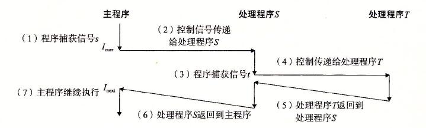
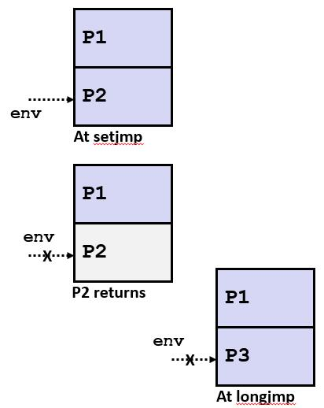

# 第十五节 信号与非本地跳转
* Linux 进程层级结构
    * 

* Shell程序
    * Shell是代表用户运行程序的应用程序。
        * 简易的Shell程序
            * 
            ```
            int main()
            {
                char cmdline[MAXLINE]; /* command line */

                while (1) {
                    /* read */
                    printf("> ");
                    Fgets(cmdline, MAXLINE, stdin);
                    if (feof(stdin))
                        exit(0);

                    /* evaluate */
                    eval(cmdline);
                }
            }
            ```
            * 
            ```
            void eval(char *cmdline)
            {
                char *argv[MAXARGS]; /* Argument list execve() */
                char buf[MAXLINE];   /* Holds modified command line */
                int bg;              /* Should the job run in bg or fg? */
                pid_t pid;           /* Process id */

                strcpy(buf, cmdline);
                bg = parseline(buf, argv);
                if (argv[0] == NULL)
                    return;   /* Ignore empty lines */

                if (!builtin_command(argv)) {
                    if ((pid = Fork()) == 0) {   /* Child runs user job */
                        if (execve(argv[0], argv, environ) < 0) {
                            printf("%s: Command not found.\n", argv[0]);
                            exit(0);
                        }
                    }

                    /* Parent waits for foreground job to terminate */
                if (!bg) {
                        int status;
                        if (waitpid(pid, &status, 0) < 0)
                            unix_error("waitfg: waitpid error");
                    }
                    else
                        printf("%d %s", pid, cmdline);
                }
                return;
            }
            ```
        * 简易shell程序例子的问题
            * 简易shell程序可以准确的等待且回收前台作业执行
            * 但是如果是后台任务
                * 当后台程序结束后会变成僵死程序
                * 永远不会被回收，因为shell程序会一直运行
                * 会造成内存泄漏，可能导致内核内存不足

        * 解决方案：异常控制流
            * 当后台进程完成时，内核将中断常规进程以提醒我们
            * 在Unix中，警报机制称为信号
    
* 信号
    * 信号是一条小消息，用于通知进程系统中发生了某种类型的事件
        * 类似于异常与中断
        * 信号从内核发送到某个进程（有时应某个进程的要求发送）
        * 信号类型被定义为一个小的整型数字
        * 信号中的唯一信息就是其ID和到达的事实
    * 信号及其对应事件
        * 

    * 信号概念：信号发送
        * 内核发送一个信号到目的进程是通过更新目的进程的上下文中的某些状态实现
        * 内核出于以下原因之一发送信号：
            * 内核侦测到系统事件如除以零（SIGFPRE）或子进程终了（SIGCHILD）
            * 其他进程调用了kill系统调用来显示的请求内核发送给一个信号到另一个进程

    * 信号概念：接受信号
        * 当目标进程被内核强制以某种方式对信号的传递做出反应时，它就接收了信号
        
        * 可能的某种响应
            * 无视信号
            * 终止进程（存在内核转储的选项）
            * 通过执行用户级别的信号处理函数来实现捕捉
                * 类似于硬件异常处理器倍调用以响应异步中断
        * 

    * 信号概念：待处理与阻塞信号
        * 如果一个信号已经发送，但是还未被接收则被称为待处理
            * 任何特定类型最多有一个待处理信号
            * **重要**：信号不会排队等待
                * 如果一个进程对信号K处于待处理状态，进程会丢弃随后发送的信号K。
        * 进程可以阻塞个别信号的接收
            * 可以传递被阻塞的信号，但是直到信号被解除阻塞才可以接收
        * 至多接收一个待处理信号

        * 内核在每个进程的上下文中维护待处理(Pending)和阻塞(Blocked)的比特向量
            * 待处理：表明待处理信号集合
                * 当传递类型为k的信号时，内核将会设置pending的第k位
                * 当接收类型为K的信号时，内核将会清楚pending的第K位
            
            * 阻塞：表明阻塞信号集合
                * 通过**sigprocmask**函数设置与清除
                * 也称为信号屏蔽(signal mask)。

    * 信号发送：进程组
        * 每一个进程属于一个进程组
        * 
        * getpgrp获取进程组
        * setpgid 更改进程组id

    * 通过/bin/kill 发送信号
        * /bin/kill程序向进程或进程组发送任意信号
        * shell
            * 
            ```
            linux> ./forks 16 
            Child1: pid=24818 pgrp=24817 
            Child2: pid=24819 pgrp=24817 
            
            linux> ps 
            PID TTY          TIME CMD 
            24788 pts/2    00:00:00 tcsh 
            24818 pts/2    00:00:02 forks 
            24819 pts/2    00:00:02 forks 
            24820 pts/2    00:00:00 ps 
            linux> /bin/kill -9 -24817 
            linux> ps  
            PID TTY          TIME CMD 
            24788 pts/2    00:00:00 tcsh 
            24823 pts/2    00:00:00 ps 
            linux> 
            ```

    * 通过键盘发送信号
        * 通过输入Ctrl-c（Ctrl-z）使得内核发送SIGINT（SIGTSTP）信号到前台进程组中的每一个作业
            * SIGINT-默认操作是终止进程
            * SIGTSTP-默认操作是停止（挂起）每个进程
        * shell  
            ```
                bluefish> ./forks 17
                Child: pid=28108 pgrp=28107
                Parent: pid=28107 pgrp=28107
                <types ctrl-z>
                Suspended
                bluefish> ps w
                PID TTY      STAT   TIME COMMAND
                27699 pts/8    Ss     0:00 -tcsh
                28107 pts/8    T      0:01 ./forks 17
                28108 pts/8    T      0:01 ./forks 17
                28109 pts/8    R+     0:00 ps w
                bluefish> fg
                ./forks 17
                <types ctrl-c>
                bluefish> ps w
                PID TTY      STAT   TIME COMMAND
                27699 pts/8    Ss     0:00 -tcsh
                28110 pts/8    R+     0:00 ps w
            ```
    
    * 通过kill函数发送信号
        * C
        ```
            void fork12()
            {
                pid_t pid[N];
                int i;
                int child_status;

                for (i = 0; i < N; i++)
                    if ((pid[i] = fork()) == 0) {
                        /* Child: Infinite Loop */
                        while(1)
                            ;
                    }
                
                for (i = 0; i < N; i++) {
                    printf("Killing process %d\n", pid[i]);
                    kill(pid[i], SIGINT);
                }

                for (i = 0; i < N; i++) {
                    pid_t wpid = wait(&child_status);
                    if (WIFEXITED(child_status))
                        printf("Child %d terminated with exit status %d\n",
                            wpid, WEXITSTATUS(child_status));
                    else
                        printf("Child %d terminated abnormally\n", wpid);
                }
            }
        ``` 

    * 信号接收  
        *  假设内核正在从异常处理程序中返回并准备将控制权传递给进程p
        * 内核计算$pnb = pending & ~blocked$
            * 进程p的待处理为阻塞信号集合

        * 如果pnb 等于0
            * 将控制传递给p的逻辑流程中的下一条指令
        * 否则
            * 选择pnb中最小的非零k位，并且强制进程接收信号k
            * 信号的接收触发了p的某种动作
            * 对pnb中的所有非零k重复上述操作
            * 将控制传递给逻辑流中的下一条指令以用于p

    * 默认行为
        * 每个信号类型具有与定义的默认行为，属于下述中的一种
            * 进程终止
            * 进程停止直到通过**SIGCONT**信号重启
            * 进程忽略信号
    
    * 设置自定义信号处理函数
        * 自定义信号处理函数，修改信号类型的默认行为
        * 
        ```
            handler_t * signal(int signum, handler_t * handler)
        ```

        * 处理函数的不同值
            * SIG_IGN：忽略signum类型的信号
            * SIG_DFL: 收到signum类型的信号后恢复为默认操作
            * 否则处理函数是用户级信号处理函数的地址（函数指针）
                * 当进程接收到signum类型的信号时调用
                * 称为“设置”处理程序
                * 执行信号处理函数被称作“捕捉”或”处理“信号
                * 当处理程序执行其return语句时，控制权返回到进程的控制流中的指令，该指令被接收到信号而中断

        * 示例  
          ```
            void sigint_handler(int sig) /* SIGINT handler */
            {
                printf("So you think you can stop the bomb with ctrl-c, do you?\n");
                sleep(2);
                printf("Well...");
                fflush(stdout);
                sleep(1);
                printf("OK. :-)\n");
                exit(0);
            }

            int main()
            {
                /* Install the SIGINT handler */
                if (signal(SIGINT, sigint_handler) == SIG_ERR)
                    unix_error("signal error");

                /* Wait for the receipt of a signal */
                pause();

                return 0;
            }
          ```

    * 信号处理函数作为控制流
        * 信号处理程序是与主程序同时运行的独立逻辑流（不是进程）
        * 
        * 虽然不是子进程，但因为是并发执行，因此不可以假设执行的顺序

    * 信号处理函数作为控制流的另一个视角
        * 

    * 嵌套信号处理函数
        * 处理函数可以被其他处理函数中断
        * 

    * 阻塞与非阻塞信号
        * 隐式阻塞机制
            * 内核阻止当前正在处理的任何类型的待处理信号。
            * 即一个SIGINT处理函数无法被其他SIGINT中断
        * 显式阻塞机制
            * **sigprocmask**函数

        * 配套函数  
            * sigemptyset - 创建空的set
            * sigfillset - 设置所有信号number到set中
            * sigaddset - 设置信号number到set中
            * sigdelset - 从set中删除信号number
            * P532页中有详细记载

    * 安全的信号处理函数
        * 处理程序之所以棘手，是因为它们与主程序并发并且共享相同的全局数据结构。
            * 共享的数据结构可能会被破坏
        * 我们将在后续探讨并发问题。
        * 目前，这里有一些准则可以帮助您避免麻烦。

        * 便携安全处理程序的准则
            * G0：处理函数尽可能的简单
                * 例如，设置全局标志并返回
            * G1: 在处理程序中之调用**异步信号安全的函数**
                * 异步数据安全
                    * 如果函数时可重入的（即所有变量存储在栈贞中）或者无法被信号中断。
                    * Posix定义了117个异步信号安全函数
                        * source "man 7 signal"指令可以查到
                        * 常用函数列表
                            * _exit, write, wait, waitpid, sleep , kull
                        * 常用但不是安全的函数列表
                            * printf sprintf malloc, exit
                            * 不幸的事实：只有write时异步安全函数
                * printf，sprintf，malloc和exit不安全！
                * 在P534页中有详细描述
                
            * G2:  在进入和退出时保存并还原errno
                * 这样其他处理就不会覆盖您的errno值
            * G3：通过展示阻止所有信号来保护对共享数据结构的访问
            * G4:将全局变量声明位volatile
                * 为了防止编译器将它们存储在寄存器中
            * G5：将全局标志声明位volatile sig_atomic_t
                * flag: 只适用于读取或写入变量（例如 flag= 1， flag++ 不适用）
                * 以这种方式声明的标志不需要像其他全局变量那样受到保护


    * 安全地生成格式化输出
        * 在处理程序中使用csapp.c中的可重入SIO（安全I/O库）。
        * C
        ```
            ssize_t sio_puts(char s[]) /* Put string */
            ssize_t sio_putl(long v)   /* Put long */
            void sio_error(char s[])   /* Put msg & exit */
        ```
        * 示例
        ```
        void sigint_handler(int sig) /* Safe SIGINT handler */
        {
            Sio_puts("So you think you can stop the bomb with ctrl-c, do you?\n");
            sleep(2);
            Sio_puts("Well...");
            sleep(1);
            Sio_puts("OK. :-)\n");
            _exit(0);
        }
        ```

    * 正确的信号处理
        * 必须等待所有子进程终止
            * 循环使用wait函数来回收子进程

    * 可移植的信号处理函数
        * 不同版本的Unix可以具有不同的信号处理语义
            * 一些较旧的系统在捕获信号后将操作恢复为默认值
            * 某些中断的系统调用可以使用errno == EINTR返回
            * 某些系统不会阻止正在处理的信号类型
        * 解决方案：sigaction函数，它允许用户在设置信号处理时，明确指定他们想要的信号处理语义。
        * C
        ```
            #include <signal.h>

            int sigaction(int signum, struct sigaction *act,
              struct sigaction *oldact);
        ```
        * sigaction函数的使用较为复杂，实际中常用Signal函数，它调用sigaction：
        ```
        handler_t *Signal(int signum, handler_t *handler)
        {
            struct sigaction action, old_action;

            action.sa_handler = handler;
            sigemptyset(&action.sa_mask); /* Block sigs of type being handled */
            action.sa_flags = SA_RESTART; /* Restart syscalls if possible */

            if (sigaction(signum, &action, &old_action) < 0)
                unix_error("Signal error");
            return (old_action.sa_handler);
        }
        ```

    * 同步流以避免竞争(race)

        * 图示
            * 
        * 简单shell有轻微的同步错误，因为它假定父级运行在子级之前。

        * 示例
        ```
        int main(int argc, char **argv)
        {
            int pid;
            sigset_t mask_all, prev_all;

            Sigfillset(&mask_all);
            Signal(SIGCHLD, handler);
            initjobs(); /* Initialize the job list */

            while (1) {
                if ((pid = Fork()) == 0) { /* Child */
                    Execve("/bin/date", argv, NULL);
                }
                Sigprocmask(SIG_BLOCK, &mask_all, &prev_all); /* Parent */
                addjob(pid);  /* Add the child to the job list */
                Sigprocmask(SIG_SETMASK, &prev_all, NULL);
            }
            exit(0);
        }

        void handler(int sig)
        {
            int olderrno = errno;
            sigset_t mask_all, prev_all;
            pid_t pid;

            Sigfillset(&mask_all);
            while ((pid = waitpid(-1, NULL, 0)) > 0) { /* Reap child */
                Sigprocmask(SIG_BLOCK, &mask_all, &prev_all);
                deletejob(pid); /* Delete the child from the job list */
                Sigprocmask(SIG_SETMASK, &prev_all, NULL);
            }
            if (errno != ECHILD)
                Sio_error("waitpid error");
            errno = olderrno;
        }
        ```

        * 上述代码是错误的，因为main函数的addjob和处理程序中的deletejob存在竞争（即不一定保证先调用addjob，然后调用deletejob）。

        * 正确代码
        ```
        int main(int argc, char **argv)
        {
            int pid;
            sigset_t mask_all, mask_one, prev_one;

            Sigfillset(&mask_all);
            Sigemptyset(&mask_one);
            Sigaddset(&mask_one, SIGCHLD);
            Signal(SIGCHLD, handler);
            initjobs(); /* Initialize the job list */

            while (1) {
                Sigprocmask(SIG_BLOCK, &mask_one, &prev_one); /* Block SIGCHLD */ <----  在此处阻塞子进程结束的信号 
                if ((pid = Fork()) == 0) { /* Child process */
                    Sigprocmask(SIG_SETMASK, &prev_one, NULL); /* Unblock SIGCHLD */
                    Execve("/bin/date", argv, NULL);
                }
                Sigprocmask(SIG_BLOCK, &mask_all, NULL); /* Parent process */
                addjob(pid);  /* Add the child to the job list */
                Sigprocmask(SIG_SETMASK, &prev_one, NULL);  /* Unblock SIGCHLD */
            }
            exit(0);
        }
        ```

    * 显式的等待信号
        * 程序的处理程序显式等待SIGCHLD到达。
        ```
            volatile sig_atomic_t pid;

            void sigchld_handler(int s)
            {
                int olderrno = errno;
                pid = Waitpid(-1, NULL, 0); /* Main is waiting for nonzero pid */
                errno = olderrno;
            }

            void sigint_handler(int s)
            {
            }

            int main(int argc, char **argv) {
                sigset_t mask, prev;
                Signal(SIGCHLD, sigchld_handler);
                Signal(SIGINT, sigint_handler);
                Sigemptyset(&mask);
                Sigaddset(&mask, SIGCHLD);

                while (1) {
                Sigprocmask(SIG_BLOCK, &mask, &prev); /* Block SIGCHLD */
                if (Fork() == 0) /* Child */
                        exit(0);
                /* Parent */
                pid = 0;
                Sigprocmask(SIG_SETMASK, &prev, NULL); /* Unblock SIGCHLD */

                /* Wait for SIGCHLD to be received (wasteful!) */
                while (!pid)
                        ;
                /* Do some work after receiving SIGCHLD */
                    printf(".");
                }
                exit(0);
            }
        ```

        * 程序正确，但是非常浪费资源

        * 其他选择
        ```
        while (!pid) /* Race! */
            pause();

        while (!pid) /* Too slow! */
            sleep(1);
        ```

        * 解决方案：sigsuspend函数
            * int sigsuspend（const sigset_t * mask)
            * 该函数等价于下述代码的原子版本（不可中断）版本
            ```," e
            sigprocmask(SIG_BLOCK, &mask, &prev);
            pause();
            sigprocmask(SIG_SETMASK, &prev, NULL);
            ```

        * 修改后代码
        ```
        int main(int argc, char **argv) {
            sigset_t mask, prev;
            Signal(SIGCHLD, sigchld_handler);
            Signal(SIGINT, sigint_handler);
            Sigemptyset(&mask);
            Sigaddset(&mask, SIGCHLD);

            while (1) {
                Sigprocmask(SIG_BLOCK, &mask, &prev); /* Block SIGCHLD */
                if (Fork() == 0) /* Child */
                    exit(0);
        
            /* Wait for SIGCHLD to be received */
                pid = 0;
                while (!pid)
                    Sigsuspend(&prev);
        
            /* Optionally unblock SIGCHLD */
                Sigprocmask(SIG_SETMASK, &prev, NULL);
            /* Do some work after receiving SIGCHLD */
                printf(".");
            }
            exit(0);
        }
        ```

* 非本地跳转
    * setjmp/longjmp
        * 强大（但很危险）的用户级机制，可将控制权转移到任意位置
            * 控制方式打破程序调用/返回机制
            * 对于错误恢复和信号处理很有用
        * int setjmp(jmp_buf j)
            * 必须在longjmp之前调用
            * 标识后续longjmp的返回位置
            * 调用一次，返回一次或多次
        * 实现方式：
            * 通过jmp_buf中存储当前的寄存器上下文，堆指针和PC值来记住位置
            * 返回0
        * void longjmp(jmp_buf j , int i)
            * 含义：
                * 从跳转缓冲区j中恢复调用环境，然后触发一个从最近一次初始化的j的setjmp调用返回
                * 这次返回i而不是0
            * 在setjmp之后调用
            * 调用一次，但用不返回
        * longjmp的实现
            * 从跳转缓冲区j恢复寄存器上下文（堆栈指针，基础指针，PC值）
            * 将%eax（返回值） 设置为i
            * 跳转到由PC指示的位置，该位置存储在jump buf j中
    * 例子
        * 目标： 从深度嵌套的函数直接返回到原始调用者
        * 示例
        ```
            jmp_buf buf;

            int error1 = 0;
            int error2 = 1;

            void foo(void), bar(void);

            int main()
            {
                switch(setjmp(buf)) {
                case 0:
                    foo();
                    break;
                case 1:
                    printf("Detected an error1 condition in foo\n");
                    break;
                case 2:
                    printf("Detected an error2 condition in foo\n");
                    break;
                default:
                    printf("Unknown error condition in foo\n");
                }
                exit(0);
            }

            /* Deeply nested function foo */
            void foo(void)
            {
                if (error1)
                    longjmp(buf, 1);
                bar();
            }

            void bar(void)
            {
                if (error2)
                    longjmp(buf, 2);
            }
        ```

        * 上述例子中，main函数首先调用setjmp以保存当前的调用环境，然后调用函数foo，foo依次调用函数bar。如果foo或者bar遇到错误，它们立即通过一次longjmp调用从setjmp返回。setjmp的非零返回值指明了错误类型，随后可以被解码，且在代码中的某个位置进行处理。

    * 非本地跳转的局限性
        * 在堆栈规则内工作
            * 只能挑到已调用但尚未完成的函数环境

            * 例1
            ```
            jmp_buf env;

            P1()
            {
            if (setjmp(env)) {
                /* Long Jump to here */
            } else {
                P2();
            }
            }

            P2()
            {  . . . P2(); . . . P3(); }

            P3()
            {
            longjmp(env, 1);
            }
            ```
            * 堆栈图
                * 

            * 例2
            ```
            jmp_buf env;

            P1()
            {
            P2(); P3();
            }

            P2()
            {
            if (setjmp(env)) {
                /* Long Jump to here */
            }
            }

            P3()
            {
            longjmp(env, 1);
            }
            ```

            * 堆栈图
                * * 

        * 综合例子
        ```
            #include "csapp.h"

            sigjmp_buf buf;

            void handler(int sig)
            {
                siglongjmp(buf, 1);
            }

            int main()
            {
                if (!sigsetjmp(buf, 1)) {
                    Signal(SIGINT, handler);
                    Sio_puts("starting\n");
                }
                else
                    Sio_puts("restarting\n");

                while(1) {
                    Sleep(1);
                    Sio_puts("processing...\n");
                }
                exit(0); /* Control never reaches here */
            }
        ```

        * 结果
        ```
            greatwhite> ./restart
            starting
            processing...
            processing...
            processing...
            Ctrl-c
            restarting
            processing...
            processing...
            Ctrl-c
            restarting
            processing...
            processing...
            processing...
        ```
